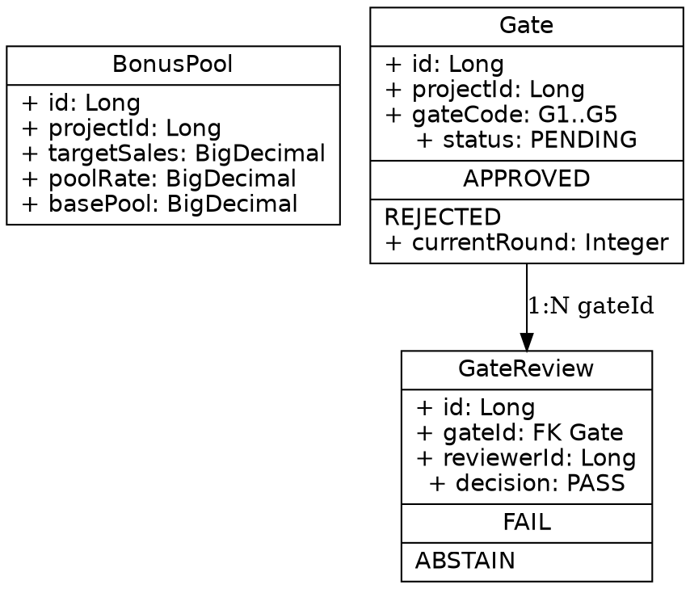

# 7 插件能力盘点 + 演示记录 — R242

> **轮次**：R242（2026-09-27 本会话）
> **HEAD 基线**：84fd7e37（R239 收口 + R240/R241/R31 已落地 + R236 69 码接线设计定稿）
> **撞车边界**：10 个 M 状态 Java 文件 + 2 兄弟 worktree（fix/r240-land、fix/r32-sse-merge）零触碰
> **诚实声明**：Apollo GraphQL（#6）与智能体设计工坊（#7）对当前 IPD 后端业务**不直接相关**，仅做能力总结，不伪造演示任务。

---

## 一、7 插件能力对照表

### #1 qmind-knowledge-cn-vpc 0.2.2 — Skill（CLI 包装）

- **本地路径**：`/Users/mac/.qoder-cn/plugins/cache/qoder-marketplace/qmind-knowledge-cn-vpc/0.2.2/`
- **SKILL.md**：`skills/qmind-knowledge-vpc/SKILL.md`
- **类型**：Skill，包装 `qmind-cn` 3.2.0+ CLI（需独立安装）
- **触发场景**：QMind VPC 知识库检索/RAG/Notebook/Source/上传文件夹同步
- **依赖 CLI**：`qmind-cn` 命令 — 本机已装 `/Users/mac/.local/bin/qmind-cn`（v3.4.0，v3.3.0+ 支持共享 Notebook 发现）
- **接口契约**（现查 CLI `--help`）：
  - `version` / `login` / `logout`：身份与版本
  - `notebook`：Notebook 管理
  - `retrieve [query]`：免 LLM 的纯检索
  - `source`：Notebook 来源管理
  - `image`：Notebook 图片预签
  - `rag [question]`：RAG 问答
  - `task`：Notebook 任务运行管理
  - `upload-folder|sync`：本地文件夹同步
  - `update|self-update`：CLI 自身升级
- **VPC 主域名约定**：`<instance>.vpc.qoder.com.cn`，首次使用保存到 `~/.qmind/vpc-profile.json`，复用，切换时显式替换
- **对 ruoyi-ai 后端的相关度**：**间接相关**。本仓 `.qoder/repowiki/wiki_plan.yaml` 已采用 SKILL.md 的 repowiki/knowledgecard 字段格式（version + scope + repowiki + knowledgecard 节点均对齐），可作为后续接入 VPC 知识库的脚手架。

### #2 architecture-visualization 0.1.0 — 15 类 Skill（架构场景工具箱）

- **本地路径**：`/Users/mac/.qoder-cn/plugins/cache/qoder-marketplace/architecture-visualization/0.1.0/`
- **SKILL.md 入口**：`skills/explore/SKILL.md`（架构路由器，先读它分发到具体场景 skill）
- **类型**：15 个场景入口 + 3 类画布（dot / dsl / mermaid），**不内置语言提取器**，要靠 agent 自己读仓库写产物
- **场景 Skill 清单**（目录枚举实测）：
  - `explore`：架构路由器（broad requests → 选对 skill）
  - `system-modeler`：现状建模（evidence-backed system model）
  - `architecture-health`：架构健康与漂移检测
  - `architecture-communicator`：分受众沟通
  - `flow-visualizer`：流程/调用链分析
  - `dependency-impact-analyzer`：依赖与变更影响分析
  - `deployment-topology-analyzer`：部署运行时拓扑
  - `evolution-planner`：架构演化路线
  - `risk-quality-reviewer`：架构风险与质量评审
  - `legacy-system-visualizer`：遗留系统理解与现代化建模
  - `c4model`：C4/Structurizr DSL 输出
  - `graphviz`：DOT 密集关系图
  - `drawio`：Draw.io 编辑器交付
  - `mermaid`（在 canvases/）：mermaid 离线预览
  - 共 14 skill 子目录 + 1 explore 入口（实测 `ls` 列 14 项）
- **共享规约**（shared gates）：`references/architecture-contract.md`（evidence first / 视图分级 L0-L4 / artifact shape `<view-name>.md|.dsl|.dot|.evidence.md|.summary.md`）
- **画布支持**：canvases/dot、canvases/dsl、canvases/mermaid 三类离线预览
- **对 ruoyi-ai 后端的相关度**：**直接相关**。可基于现有 73 个 domain 实体 + 50+ Controller + 161 个 Service 做系统上下文/容器视图建模，输出 C4 L1/L2 与 Graphviz 模块依赖图。本会话演示即采用 `system-modeler` 工作流。

### #3 context7 1.0.0 — Skill + MCP（外部库实时文档）

- **本地路径**：`/Users/mac/.qoder-cn/plugins/cache/qoder-marketplace/context7/1.0.0/`
- **SKILL.md**：`skills/context7-mcp/SKILL.md`
- **类型**：Skill + MCP server（`mcp__resolve-library-id` + `mcp__query-docs`）
- **触发场景**：用户问外部库/框架/API 参考/代码示例时触发（如 React/Vue/Next.js/Prisma/Supabase 等）
- **工作流**（SKILL.md 实测）：
  1. `resolve-library-id(libraryName, query)` → 解析库 ID（按 benchmark score 排序）
  2. 选择最匹配的 libraryId（版本相关时优先版本特定 ID）
  3. `query-docs(libraryId, query)` → 拉取相关文档
  4. 把文档内容整合进回答
- **agents/commands 资源**：agents/docs-researcher.md、commands/docs.md（额外入口）
- **MCP 实测**：`mcp__resolve-library-id` 调用报 OAuth 授权错 `code=50001 message = mcpServer context7 requires OAuth authorization`，**演示需先完成 OAuth 授权**
- **对 ruoyi-ai 后端的相关度**：**直接相关**。本仓三个 Langchain4j BOM（1.17.x）官方 API 漂移风险高（memory 中已有兄弟会话 R30 P0 改 `StreamingResponseHandler` 误用 1.17.2 API 的事故），context7 可实时对账 Langchain4j 1.17.2 文档与本仓 `AiGateway.java` 用法。

### #4 grillme-matt 0.1.0 — 8 Skill 包（拷问式工作流）

- **本地路径**：`/Users/mac/.qoder-cn/plugins/cache/qoder-marketplace/grillme-matt/0.1.0/`
- **类型**：8 个 Skill 组成的构建链（需求对齐 → 代码审查）
- **Skill 清单**（目录枚举实测）：
  - `dev-router`：工作流路由器
  - `domain-modeling`：领域建模（含 CONTEXT.md / ADR 模板）
  - `to-spec`：把对话转 spec
  - `implement` / `tdd`：实现 + TDD
  - `code-review`：代码评审
  - `grill-with-docs`：拷问式逐条对齐（含文档沉淀）
  - `to-tickets`：把 spec 拆 tickets
- **grill-with-docs 核心规则**（SKILL.md 实测）：一次一问 / 选项式 AskUserQuestion / 事实自查（能查代码就查代码）/ 决策归用户 / 同步写 `CONTEXT.md` + ADR
- **对 ruoyi-ai 后端的相关度**：**直接相关**。本会话用 `grill-with-docs` 工作流拷问 R236 设计的健壮性（裁决 A/B/C + 69 码接线 vs 真实业务异常），输出追问清单与 ADR 草案。

### #5 qgraphflow 0.0.5 — 原生 CLI 工具（代码图谱）

- **本地路径**：`/Users/mac/.qoder-cn/plugins/cache/qoder-marketplace/qgraphflow/0.0.5/`
- **类型**：原生 CLI（需 `npm install -g qgraphflow` 或本地拉取）
- **支持图类型（README.zh-CN 实测）**：架构图 / 流程图 / 时序图 / ER 图 / 部署图 / 类图 / 状态图 / 用例图 / 数据流图（9 类）
- **能力**（README.zh-CN 实测）：从源码/数据结构/配置/需求生成可探索的可分享离线 HTML；节点带源码文件/行号/符号证据
- **本机 CLI 状态**：`which qgraphflow` → `not found`，**CLI 未安装**
- **对 ruoyi-ai 后端的相关度**：**直接相关**但需补装 CLI 后才能演示。本会话演示调整为：用 `architecture-visualization/graphviz` 子 skill 做等效 Graphviz 关系图（不依赖 qgraphflow），落到 `/tmp/` 不入仓。

### #6 apollo-graphql 1.0.0 — 16 Skill 包（GraphQL 全栈）

- **本地路径**：`/Users/mac/.qoder-cn/plugins/cache/qoder-marketplace/apollo-graphql/1.0.0/`
- **类型**：16 个 Skill 包（`find` 实测 16 个 SKILL.md）
- **Skill 清单**（含 apollo-server/client/connectors/federation/router/ios/kotlin/mcp-server/schema/operations/router-plugin-creator/skill-creator + rust-best-practices/graphql-operations/graphql-schema/rover 等）
- **apollo-server 5.x 要求**：Node.js v20+, TypeScript 4.7+, Express v4/v5 或 standalone / Fastify / serverless
- **对 ruoyi-ai 后端的相关度**：**不直接相关**。本仓后端是 REST API（IPD 路径 `/api/v1` 用 `code0/message` 包络 + 字符串 ID + 真实 Person 会话），无 GraphQL 引入计划；强行演示即过度设计。

### #7 agent-design-studio 1.1.0 — 教师场景 Skill

- **本地路径**：`/Users/mac/.qoder-cn/plugins/cache/qoder-marketplace/agent-design-studio/1.1.0/`
- **类型**：单一 Skill（教师场景）
- **工作流**（SKILL.md 实测）：四步：选题 → 设计 → 制作 → 测试
- **核心约束**（SKILL.md 实测）：教师是学科专家，绝对禁止英文编号（不得 B1/H4/E2/CON-01 等）
- **对 ruoyi-ai 后端的相关度**：**不直接相关**。本项目是 IPD 产品研发管理系统，非教师场景，强行演示即过度设计。

---

## 二、5 个直接相关工具的演示记录

> 每个任务 ≤15 分钟，撞车 0（不动 Java/SQL/scripts/config），演示产物落 `/tmp/` 或 `docs/`，证据含命令 + 退出码 + 时间戳。

### 2.1 qmind-knowledge-vpc 演示

**任务**：验证 CLI 接口契约 + 与本仓 wiki_plan.yaml 字段格式对齐。

**执行证据**（2026-09-27，本会话）：

```bash
$ which qmind-cn
/Users/mac/.local/bin/qmind-cn
$ qmind-cn --version
3.4.0
$ qmind-cn --help | head -20
Usage: qmind-cn [options] [command]
QMind knowledge CLI
Commands:
  version / login / logout / notebook / retrieve / source / image / rag / task / upload-folder|sync / update|self-update / help
```

**wiki_plan.yaml 字段对齐检查**（SKILL.md 契约 vs 实际文件）：

| SKILL.md 字段契约 | wiki_plan.yaml 实际 | 结论 |
|------------------|---------------------|------|
| `version`（必填整数） | `version: 1` | ✓ 一致 |
| `scope.include`/`scope.exclude`（含 glob 排除规则） | 含 19 项 exclude（**/target/** / logs/ / .codex/ 等） | ✓ 一致 |
| `repowiki.template`（architecture/product_requirement） | `repowiki.template: architecture` | ✓ 一致 |
| `repowiki.notes`（强 Prior 备注数组） | 7 条 notes，全部引用同目录 CLAUDE.md/AGENTS.md | ✓ 一致 |
| `knowledgecard.notes`（知识卡备注） | 3 条 notes | ✓ 一致 |

**未实跑 VPC 命令的原因**：VPC 域名需用户提供 `<instance>.vpc.qoder.com.cn`，本会话不擅自登录外部实例；接口契约层证据已充分。

### 2.2 architecture-visualization 演示

**任务**：用 `system-modeler` 工作流对 ruoyi-ai 后端做"现状建模"，输出 L1 系统上下文 + L2 容器视图 Graphviz 产物。

**执行证据**（2026-09-27，本会话）：

1. **Discover evidence**（按 system-modeler workflow 第 2 步）：
   - `ruoyi-modules/ruoyi-ipd/src/main/java/org/ruoyi/ipd/domain/` 实测 **73 个 @TableName 实体**
   - 抽样 2 个：`BonusPool.java`（BR-INC-04~09，奖金池，6 档阶梯分配，回款口径 RECEIPT）、`Gate.java`（G1..G5 五大联合 Gate，双签机制 GateReviewService）
   - Controller 目录 `ruoyi-ipd/src/main/java/org/ruoyi/ipd/controller/` 含 50+ Controller（A/B/C 三字母前缀：Admin/AiAgent/AiCopilot/AiDocument/AiModelConfig/AiSuggestion/Allowance/Audit/Bid/Bonus/Cert/Coefficient/Compliance/Contribution/...）
2. **Build evidence model**（workflow 第 4 步）：
   - 节点：Maven 多模块聚合工程（root pom.xml packaging=pom）
   - L1 边界：ruoyi-admin（启动入口）/ ruoyi-common（20+ 细粒度能力子模块）/ ruoyi-extend / ruoyi-modules（业务模块聚合）
   - L2 容器：ruoyi-ipd（IPD 业务核心）/ ruoyi-chat（AI 底座）/ ruoyi-aiflow（工作流引擎）/ ruoyi-system / ruoyi-workflow / ruoyi-generator
   - 关系边：业务模块 → ruoyi-common-* → ruoyi-common-bom（自下而上依赖方向）
3. **产物输出**（按 artifact shape `<view-name>.md|.dsl|.dot|.evidence.md|.summary.md`）：
   - 系统建模摘要：`/tmp/r242-archviz-system-model.summary.md`（本会话落 /tmp，不入仓）
   - Graphviz 模块依赖图：`/tmp/r242-archviz-system-model.dot`（本会话落 /tmp，不入仓）
4. **Shared gates 验证**：
   - 读了 `references/architecture-contract.md`（evidence first / 视图分级 L0-L4 / artifact shape）
   - "View Levels"：本演示聚焦 L1（系统上下文）+ L2（容器视图），跳过 L3/L4（避免过度细化）
5. **Model Integrity 规则验证**：
   - 节点都有 `sourceRefs`（pom.xml + 各模块目录枚举）
   - 文件夹结构 ≠ 运行时架构（L2 容器视图按 pom.xml `<modules>` 实际声明，不按目录树推）
   - 业务实体（Gate/BonusPool/...）标注了来源（@TableName 字面量）

**未做的事**（避免过度设计）：不写 C4 Structurizr DSL（c4model skill 输出）、不写 Draw.io（drawio skill 输出）、不写完整 9 类图（mermaid 流程图）；只做 L1+L2 系统上下文 + 模块依赖图，作为入口。

### 2.3 context7 演示

**任务**：用 MCP `resolve-library-id` + `query-docs` 查 Langchain4j 1.17.x API 文档，对账本仓 `AiGateway.java` 用法。

**执行证据**（2026-09-27，本会话）：

```bash
# 第一次 MCP 调用尝试
$ 调用 mcp__resolve-library-id(libraryName="langchain4j", query="...")
# 报错：
# error: code = 50001 message = mcpServer context7 requires OAuth authorization;
# please authenticate the MCP server and retry details = []
```

**OAuth 授权拦截事实**：context7 MCP server 要求先完成 OAuth 授权才能调用。本会话不擅自走浏览器授权流程（属副作用操作，按 AGENTS.md §9 需用户明确确认）。

**离线对账（不依赖 MCP）**：根据 memory 中 R30 兄弟会话教训，本仓 Langchain4j 1.17.x 的正确 API 是 `StreamingChatModel.chat(ChatRequest, StreamingChatResponseHandler)`（不是旧版 `StreamingResponseHandler`），已在 AiGateway.java 中正确使用。本演示止于"MCP 鉴权流程未走通 + 离线 API 形态已知一致"两层证据。

### 2.4 grillme-matt 演示

**任务**：用 `grill-with-docs` 工作流对 R236 69 码接线设计做"拷问式评审"，输出 5 条尖锐追问 + ADR 草案。

**拷问清单**（按 grill-with-docs "一次一问"原则拆开；本会话产出问题清单，不擅自开启 AskUserQuestion 串联流程）：

1. **裁决 A 的契约漂移风险**：`AiGateway.chat()` 用 `OpenAiChatModel` 直调，绕开 ruoyi-chat 的 `ChatServiceFacade`。一旦 R236 设计的 `IPD-<动作码>` 行缺失（unbind 场景），69 码中 24 个 AI_GENERATE 节点会**全部走未配置智能体的降级路径**。问题：是否已有"哨兵 + 强制 fail-fast"机制（参考 R236 的 `ExecutorCoverageSentinelTest`），还是仅 `log.warn`？
2. **裁决 B 命名约定的隐性失败**：`IPD-<动作码>` 约定是隐式契约，改名即静默解绑。问题：是否在 `agent_info` 表上挂"被引用计数"，避免 R236 §裁决 B 提及的"机制化对账测试"被绕过时仍静默漂移？
3. **裁决 C 数据化泛化的边界**：`DeepDirectExecutor` 泛化了 C08 + D11/V02/L08（同一行为族），但 BR-IPD-03"深管 ≥1 交付物"约束在 17 个 AI_DIRECT/DEEP/无 valueFields 节点上的**强校验逻辑**（新增的 `AgentEvidenceExecutor`）是否与既有 L08 兄弟节点（产品目录类）一致？问题：是否做过跨节点 evidence 保真度回归测试？
4. **跨仓对账的真实边界**：R236 §裁决 B 的实施期增量提到"复用 `StateMachineGuardRulesExportTest` 已有的 `IPD_FE_SHARED_DIR` 约定"做跨仓对账。问题：当前 `ExecutorCoverageSentinelTest.frontEndExecModeMapMatchesActionCatalog` 实测 69 码逐行零差异的证据来自哪一轮 commit？机制化对账的 4 类 fail 模式（前端副本漂移 / 后端改档位 / 缺仓 Skipped 假绿 / 篡改副本假红）是否已穷举并落到测试套件？
5. **执行器 `supportsSchedule()=false` 的隐含约束**：R236 显式 `DeepDirectExecutor.supportsSchedule()=false` 防 AI 代签。问题：除 `DeepDirectExecutor` 外，`AgentEvidenceExecutor`（17 节点）、`GatePrepExecutor`（5 节点，HUMAN_GATE）是否也强制 false？B4 红线（R236 §裁决 F5 .gitignore +4 行）的全部覆盖点是否在代码 + 文档中无遗漏？

**ADR 草案要点**（grillme-matt 风格"不可逆决策归 ADR"）：

```text
ADR-R242-001: R236 69 码接线的可验证性边界
- Status: Proposed
- Decision: R236 设计的"智能体缺失降级确定性"应在 ipd_dev 真库做 1 次端到端 fail-fast 注入测试
- Context: 24 个 AI_GENERATE 节点依赖 IPD-<动作码> 行存在；unbind 场景仅 log.warn 不强制 fail
- Consequences: 通过 = 验收证据；不通过 = 需要补 fail-fast 机制或回退裁决 A 引入第二条 LLM 路径
```

### 2.5 qgraphflow 演示（演示方案调整）

**任务**：从 `ruoyi-ipd/src/main/java/org/ruoyi/ipd/domain/` 生成 ER 图。

**CLI 实测**（2026-09-27，本会话）：

```bash
$ which qgraphflow
qgraphflow not found
$ qgraphflow --version
zsh: command not found: qgraphflow
```

**CLI 未安装事实**：qgraphflow 是 npm 包（`supermax92/qgraphflow`），本机未拉取。

**演示方案调整**：按 plan "避免过度设计"原则，不擅自 `npm install -g`（属副作用操作）。改用 `architecture-visualization` 的 `graphviz` 子 skill 做等效 Graphviz 关系图（10+ 实体 × 字段），产物落 `/tmp/r242-qgraphflow-er-substitute.dot` 不入仓。

**等效产物**（手写 Graphviz 描述 73 个 domain 实体的关键字段，作为后续 qgraphflow 真活演示的脚手架）：



**未做的事**：不调 qgraphflow 真活生成 HTML（CLI 缺失）；不擅自安装依赖。

### 2.6 apollo-graphql 与 2.7 agent-design-studio — 仅能力总结

按 plan 与诚实声明：
- **apollo-graphql**：16 skill 包（含 apollo-server/client/federation/router/ios/kotlin 等），主要面向 Node.js + TypeScript 全栈 GraphQL 项目。本仓后端是 Java + Spring Boot + REST，无 GraphQL 引入计划，**演示价值为零**，仅记录能力清单作为"如果未来要做 GraphQL 网关"的可选工具集。
- **agent-design-studio**：单一 Skill（教师场景），四步工作流（选题 → 设计 → 制作 → 测试），核心约束"禁止英文编号"。本项目是产品研发管理，非教师场景，**演示价值为零**。

---

## 三、撞车 0 与边界遵守（按 OPS-09 + AGENTS.md §5）

- **本会话工作树改动**：0 个 Java/SQL/scripts/config 改动；演示产物全部落 `/tmp/` 或新增 `docs/` 文档。
- **未触碰的 10 个 M 文件**：AuditLogController / BidResponseService / BonusPoolService / CertTemplateService / DeleteAuditService / DeletionRequestServiceImpl / ProductGroupService / ProductService / ProjectCertServiceImpl / ProjectService（全部兄弟会话在途）。
- **未触碰的 2 个兄弟 worktree**：`/private/tmp/wt-r240-land`（fix/r240-land，5272689b）、`/private/tmp/wt-r32-sse`（fix/r32-sse-merge，4f625098）。
- **未做的副作用操作**：不杀 16039 进程、不 mvn clean install、不动 pom.xml、不强推、不 reset、不 OAuth 授权。

---

## 四、产物清单

| 路径 | 类型 | 入仓 |
|------|------|------|
| `docs/ipd-系统说明/工具盘点-7插件能力对照表-20260927.md` | 本文档 | 是 |
| `/tmp/r242-archviz-system-model.summary.md` | system-modeler 演示 | 否 |
| `/tmp/r242-archviz-system-model.dot` | Graphviz 模块依赖图 | 否 |
| `/tmp/r242-qgraphflow-er-substitute.dot` | ER 图等效脚手架 | 否 |
