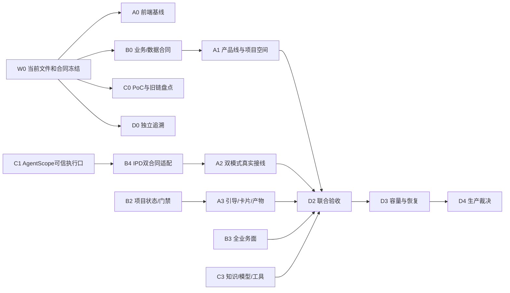

# IPD 全功能生产就绪：A/B/C/D 四路任务计划

> 2026-09-29 现态：`PARTIAL`。这是既有看板总控卡 `61217664-73c1-4858-bd73-c3cfcaf13bcb`、W0–W8、U0–U2、G1–G3 和 49 页/249 AC 的执行分工，不新建任务状态源。状态、认领、阻塞、验收只在本机看板及《开发计划-看板镜像》维护。本文不将计划项标为完成。

## 1. 范围、现态与生产就绪判据

目标覆盖正式 IPD 前端、IPD 业务后端、AgentScope Java 与现有知识/模型/工具能力、数据、部署运行和独立验收。旧 React 原型、AI 聊天前端、其他项目的应用与数据不在范围内。生产就绪是同一源码版本下业务合同、真实数据、权限、模型/知识/工具、浏览器和运行恢复同时成立；源码存在、编译通过、局部测试通过或看板 `done` 都不能单独证明。

当前事实：后端主树 `3c67f100`、正式前端 `410ed43`、AgentScope PoC `d8231596`。本轮只读 `git status --short` 分别看到后端主树 92、前端 31、PoC 35 个状态条目（含 staged/unstaged/untracked；条目数不是缺陷数）；`fix/r240-land` 指向缺失目录、标为 prunable，不能当作可直接合并的活动工作树。PoC 与主树的重复/差异须逐文件复核，保留已在主树更正确的实现；未提交文件也必须纳入候选与验收。

本机开发库已有空结构 `product_lines`、`product_line_members`、`products.product_line_id`；回读时 368 条产品均未分配产品线。用户现确认先设**考勤、门禁、视频**三个产品线，管理员可手动增删改；具体 368 条产品的逐条归属未给定，不从组织 `product_groups` 推断。产品线是团队大工作空间，`ProductLine → Product` 为 1:N；现有 `Product ↔ Project` 1:1 不变；项目是小工作空间。本人申请加入，空间组长或管理员审批，管理员指定组长。团队成员资格不能替代项目成员权限。

两种 AI 能力须分开：传统管理界面中的**AI 副驾**是受控问答/辅助建议；切换按钮进入的**AI 工作界面智能体**按选定项目引导和执行产品设计。最终二者均使用 AgentScope 能力，但使用不同 agentId、执行合同、会话和状态；不能只把同一 `streamCopilot` 请求换一个布局名称。当前前端按钮切布局，IPD 发送仍走旧 `AiGateway`，故整体未闭环。

生产完成需要同时满足：

1. DOC-01～06、业务决策、49 页原规格、249 条 AC 和当前 API/Schema 有逐条可追溯结论，未实现/待验收不计通过。
2. 真实 Person 会话中，产品线/项目/动作/资料/工具权限和租户隔离正反例成立；关键写操作有真人批准、版本、审计、回读和恢复。
3. 22 小阶段、69 标准动作及六大阶段 Gate 的项目级状态有持久化、重启回读和一致的前后端行为；不能用局部 ref 或 `advanced=true` 回执代替推进状态。
4. 副驾与智能体分别通过受控 AgentScope 入口完成真实模型、知识、工具、预算、事件、取消和失败恢复；老链只在全部消费者迁走后退役。
5. 正式 Vue 前端的 49 页按适用角色和规格完成浏览器操作、响应式/键盘/空态/无权/异常验收；`check:type`、全量 IPD Vitest、`build:antd`、后端测试/构建及门禁均以**最终源码**重跑。
6. 真实数据库、向量后端、模型、HTTP/SSE/WS、浏览器和运维恢复证据指向同一运行版本；容量指标在测前确定。发布、生产写入、正式迁移与回滚演练按授权窗口执行。

## 2. 四份任务的独占写面

| 任务 | 唯一写入范围 | 主要目标与交付物 | 不能跨写 |
| --- | --- | --- | --- |
| **A 正式前端与体验** | `/Users/mac/Documents/ruoyi-ipd-web/apps/web-antd/**`、仅本仓必要配置/测试 | 产品线团队空间和项目桌面、管理员空间管理/申请审批、双模式切换、49 页真实操作、可访问性与前端质量门 | 后端 Java/SQL、AgentScope 内核、看板镜像 |
| **B IPD 业务与数据** | `/Users/mac/Documents/ruoyi-ai/ruoyi-modules/ruoyi-ipd/**`、`docs/script/sql/update/` 内本任务新增版本脚本 | 产品线/产品/项目层级、业务状态机/69 动作、权限/审批/审计、IPD AI 适配器、数据迁移与 API 合同实现 | ruoyi-chat/aiflow 内核、正式 Vue、共享看板 |
| **C AgentScope 与知识能力** | `ruoyi-modules/ruoyi-chat/**`、`ruoyi-modules/ruoyi-aiflow/**`、必要的 `ruoyi-common-chat/**` 与根 POM 依赖治理（先登记独占） | 唯一 AgentScope 执行核、模型/知识/工具/MCP/任务能力、旧聊天与 aiflow 迁移、无消费者旧链退场 | ruoyi-ipd 业务实现/SQL、正式 Vue、共享看板 |
| **D 独立验证与发布治理** | `docs/ipd-系统说明/验收/**`、本计划与唯一看板镜像、独立验收脚本/CI 工作流（先登记文件白名单） | 249 AC/49 页追溯、契约/安全/性能/运行核验、数据与发布恢复演练、证据裁决 | A/B/C 正式源码及其同名测试、业务库写入 |

四份任务可以**同时读取**全部允许来源；任何共享文件（根 POM、DOC-06、配置、看板、CI、数据库迁移）在动笔前确定唯一所有者。D 独占看板/镜像写入，A/B/C 只提交证据与变更建议，由 D 依据原卡 ID 回写；若已有实际主协调者占用 D 写面，D 先交付补丁与证据，主协调者串行回写。A/B/C 各自给新测试唯一文件名，禁止覆盖他组在途文件。跨组接口只经版本化合同和样例交接。

## 3. A：正式前端与体验（U0–U2，业务 UI）

| 节点 | 前置条件与行动 | 可复核产物/成功条件 | 失败路径 |
| --- | --- | --- | --- |
| A0 基线接手 | 列出正式前端所有未提交/未跟踪文件，逐项归属旧卡与实际消费者；冻结路由、`/api/v1` code0/message、字符串 ID 与 Ant Design Vue 基线 | 文件接手表、影响页/测试、前后端契约对照；无遗漏引用未跟踪文件 | 来源冲突交 D 登记，保留原文件，暂不重写 |
| A1 团队空间 | 新增产品线列表/详情/管理员增改停用、本人申请、空间组长或管理员审批、组长任命、产品归属；三个初始空间读后端；产品线→多个产品→各产品项目目录 | 真 Person 正/反权限、申请→批准→刷新回读、管理员改名/停用边界、跨空间不泄漏；未知产品归属显示“待分配” | B 合同或数据未齐时显示明确待办/错误，不拼假空间 |
| A2 双 AI 模式 | 保留传统页面副驾；切换按钮进入项目 AI 工作界面并明确当前产品线/项目；两模式使用不同入口/agentId，切换和 A→B→A 清理或恢复各自会话/待审卡；项目未选或越权禁止运行 | 请求抓包可区分副驾/智能体，项目 ID/会话/任务不串；断线、取消、刷新、重试有真实状态 | C/B 入口未交付时禁用智能体执行并显示原因，不回退成副驾冒充 |
| A3 项目执行桌面 | 22 小阶段导航、69 动作、Gate、资料/知识来源、建议卡、画布、文档/产物与待审批统一到项目小工作空间；真人确认后调业务 API 并回读 | 一条完整链：目录→引导→待审→确认→业务表回读→刷新恢复；不存在“只暂存卡片/只切 pane”假完成 | 业务状态不足则保留已证实的副驾功能，智能体区块标 `PARTIAL` |
| A4 49 页与配置体验 | 按页域完成产品/项目/需求/认证/预算/激励/人员/审批/配置中心等原规格；模型/知识/MCP 页面展示真实健康、来源、费用和影响，旧页仅在等价入口验收后退场 | 每页加载/成功/空态/无权/断网/窄屏/键盘证据；业务提交不依赖 mock | 原合同冲突交 D+B 裁决，禁止靠前端绕过权限 |
| A5 质量门 | 最终源码运行指定 `pnpm run check:type`、全量 `pnpm exec vitest run --config vitest.ipd.config.mts`、`pnpm run build:antd`，检查 TS 诊断和声明产物 | 退出码、测试发现数/失败数、产物、浏览器证据与版本对应；49 页缺证保留未验状态 | 定位失败文件和条件，有限修复后按影响面复跑；禁跳过文件/放宽 tsconfig |

A 不用旧 React 原型或聊天前端替代正式 Vue；本机 vite 若启动，按本仓规定用 `node node_modules/vite/bin/vite.js`，监听与代理仅用本项目端口。API 客户端不可把框架 `code=200/msg` 或数字化 ID 混入 IPD 契约。

## 4. B：IPD 业务与数据（业务卡、W8 的 IPD 适配）

| 节点 | 前置条件与行动 | 可复核产物/成功条件 | 失败路径 |
| --- | --- | --- | --- |
| B0 范围与合同 | 逐文件接手 `ruoyi-ipd` 未提交成果；对 DOC-01～06、业务决策、当前 Schema、权限、前端调用抽取真实差异；发布 B→A API 契约和 B↔C AI 适配口 | DTO/错误码/对象关系/权限矩阵版本和正反样例；`ProductLine 1:N Product`、`Product 1:1 Project` 不变量 | 合同冲突交 D 登记，不擅改原决策或猜测字段 |
| B1 产品线团队 | 完成产品线安全增/改/停用、管理员设组长、本人申请和组长/管理员审批、成员退出/变更；在本机开发库幂等初始化考勤/门禁/视频三个空间；产品可由管理员手工归属，存量 368 条保留“待分配”清单 | 真 Person HTTP/DB：三空间出现，成员审批审计/旧组长失权、1:N 多产品、跨租户/跨空间/非项目成员拒绝；停用不得遗留活动产品/审批 | 初始化/回填前备份并核目标库；失败保留旧数据与操作证据，拒绝组织组名自动回填 |
| B2 项目业务主链 | 核产品与项目双向唯一约束、阶段/Gate、22 小阶段/69 标准动作/人员 owner/交付物；`advance` 持久化游标、版本和门禁结果，回读真实状态；项目 ID 进入引导上下文 | 真库一条项目链和负例：刷新/重启保持状态，未过门禁不可推进，重放无重复业务副作用 | 无法安全推进则拒绝并返回具体门禁证据，不回传伪 `advanced=true` |
| B3 全功能业务面 | 以 249 AC/105 BR/49 页为矩阵，逐域核项目、需求、场景、认证、KPI/激励、成本/预算、人员/HR/移交、数据删除、审计、配置及 AI 文档；修复实际未闭环路由/数据而非按“源码已有”划 done | 每项有 API、角色、业务表、前端消费者、正反例、审计和 D 的独立验收；原有能力不减少 | 无法取真实外部源或业务规则冲突标阻塞并留替代操作，不造测试数据冒充正式来源 |
| B4 IPD AgentScope 接入 | C 发布可用端口后，B 建立服务端 `productLineId+projectId+Person` 归属守卫、任务/审批/产物/预算/审计适配；分别定义副驾和智能体 Agent Contract，迁移七类 IPD AI 消费者及同步/流式/embedding | 副驾仍受控问答，智能体按项目任务执行；真实模型/RAG/工具/人审/业务回读；未选项目、跨空间、取消、失败负例 | C 不满足安全/取消/模型合同则不开放智能体入口；旧链按消费者有序保留 |
| B5 数据演进 | 所有新增 DDL 有前置校验、幂等或版本校验、快照、只读回读与补偿；产品线回填只接受权威 ID 映射，旧产品组与产品线始终分离 | 表/索引/唯一约束/租户/软删与实体一致；迁移两次不重复；有效项目无错误归属，未映射行可查询 | 生产迁移需授权；异常停止新写并按已验证备份/补偿恢复 |

B 的服务层必须从 IPD Person 会话取操作者，拒绝请求体伪造角色/审计身份；空间成员不自动取得项目 AI、资料或工具权限。SQL 本地开发库执行与生产数据库写入分别记证，生产执行只在明确授权和发布窗口进行。

## 5. C：AgentScope、模型、知识、工具和旧链退场（W0–W7、W8 的 chat/aiflow）

| 节点 | 前置条件与行动 | 可复核产物/成功条件 | 失败路径 |
| --- | --- | --- | --- |
| C0 工作树整合 | 对 PoC `d8231596` 与主树逐提交/逐未提交文件比对，R240 缺失工作树仅按可读提交补丁评估；对每个差异判保留主树/移入/修改/舍弃，先保留可恢复快照 | 候选清单、消费者影响、实际差异和回归；无 wholesale 合并、无丢失兄弟在途文件 | 不能确认来源时保留候选，不覆盖当前主树；Git 提交/合并/归档须依授权与治理规则 |
| C1 唯一内核 | AgentScope 2.0.3 统一会话/状态/并发/取消/工作区四维隔离；整轮门覆盖准备、历史、RAG、模型、工具、落库；SSE/WS/AG-UI 恰一终态，支持崩溃/重启/双副本 | 同键竞争、跨项目/Person、路径穿越、取消迟到帧、存储失败正反例；正式入口来源可追溯 | 开关保持关闭或故障拒绝，不在同一请求并跑两内核 |
| C2 模型和预算 | 与 B 的 `ai_model_configs` 合同对齐，实际模型/端点/参数/密钥版本生效；真 A→B→A，usage、预算预占/结算、缓存回收；平台其他消费者逐项映射 | DB/API/实际模型出站/usage/审计一致；秘密不外泄，显式无效模型 fail closed | 配置缺失停止调用，不偷偷使用默认模型或把未知 usage 记 0 |
| C3 知识与记忆 | 盘点现有 Weaviate 默认链、可选 Milvus/Qdrant、IPD 文档向量、`KnowledgeAccessGate`；在 AgentScope 上做唯一稳定应用层检索适配，保持文档版本/权限/项目过滤、摄取/撤销/重建/引用 | 真文件→embedding→向量→授权命中/拒绝/撤销→引用回源；缓存与项目/Person隔离；容量证据 | 旧知识链尚有消费者时保留；仅删除已证明无消费者的依赖，避免本轮 `AgentScopeRagPocIT` 缺类重演 |
| C4 工具/MCP/业务权能 | 用既有 `PolicyDecision`、审批与效果账本包装 AgentScope 真执行前边界；MCP 目录单一、凭据 write-only、反向依赖可靠；受控 Skills/任务/子智能体/记忆/主动任务/产物/进化接同一内核 | DENY/未批准 ASK 零副作用，批准一次性、失败 UNKNOWN 可核对；子任务不越权，预算/取消贯穿 | 未证安全前工具默认关闭；不可据目录可见/事件记录宣称已执行 |
| C5 全入口迁移与清理 | 旧聊天 SSE/WS、Coding Harness、aiflow 节点和其他实际 AI 消费者逐一迁入；通过消费者图与合同验收后退役旧模型/知识/MCP路径及依赖 | 每入口保留原输出/错误/历史/权限；依赖树和 `rg` 无在用旧消费者；清理后全量回归 | 发现仍在用消费者立即恢复依赖/代码，不以删测试求绿；需业务裁决的旧功能不擅退役 |

C 的接口必须把 IPD Person/项目上下文作为**B 校验后的可信输入**，不自行读浏览器角色快照。AgentScope 原生能力与现有自研业务审批/计划/账本采用“替换/包装/保留”逐项裁决，防止第二套任务权威。`agentscope-harness` skill 的静态/反例门必须在实际扫描范围运行；PoC 单测不代表正式业务入口验收。

## 6. D：独立验证、SSOT、运行与发布（G1–G3）

| 节点 | 前置条件与行动 | 可复核产物/成功条件 | 失败路径 |
| --- | --- | --- | --- |
| D0 控制面 | 固定 A/B/C 文件白名单、基线哈希和卡片归属；看板原卡认领/阻塞/待审/完成串行回写；独立核查主树、PoC、R240 和未提交内容 | 看板与镜像同 ID/同状态、差异候选有处置、无重复卡或静默接手 | 哈希变化则重算并停止写入，交回唯一写入者 |
| D1 追溯与契约 | 49 页、249 AC、105 BR、DOC-01～06 到路由/DTO/DB/角色/页面/测试逐条映射；修复跨仓 API 棘轮/文档数据库漂移门的误报及假绿 | “未实现/源码候选/测试通过/真链通过/生产可用”五态清楚；负控会红，漏测数为 0 | 扫描器总数只作线索，人工核真实消费者和运行结果 |
| D2 独立质量与安全 | 对 A/B/C 最终候选跑编译、单测、全量回归、浏览器、权限负例、数据回读；双副本、断连、重放、SSRF/提示注入、缓存/向量撤销验证 | 原始日志、XML 测试数、截图/网络、SQL 只读结果和源版本成套；0-test/共享 target 假绿假红被排除 | 缺依赖/环境标明确阻塞，不能把 mock 绿升级为业务验收 |
| D3 容量与运维 | 与业务先定容量/SLO；测模型延迟、并发、数据库/向量查询、队列/成本；演练备份恢复、Schema 兼容、配置切换、失败停止与回滚 | 可执行运行手册、告警与故障定位、恢复时间和数据一致性实测；敏感日志检查 | 不达阈值回交 A/B/C 对应源头，禁止靠扩大超时掩盖 |
| D4 最终裁决 | 按同一版本核 A+B+C 与 249 AC/49 页全部必交项，发布准备、灰度/回滚计划与责任人；生产动作单独审批 | 无遗留 P0 和用户已要求 P1；每个通过项有独立证据；授权后发布并按真实关键路径冒烟 | 任一关键项未知则 `PARTIAL`/`BLOCKED`，不得用计划或看板旧 `done` 宣称生产就绪 |

D 负责独立 **Validator**，不修改被测源码来把测试改绿。共享 Maven `target/` 一次只由一个构建者使用；必要时隔离源码副本复现，再回正式主树复核。发布、合并、提交、推送、生产迁移、数据删除与外部发送均另按当前授权边界执行；计划本身不授权这些动作。

## 7. 并行依赖图与集成门

四路的**文件写入**互不干扰；功能依赖必须按以下门交接：

- **G0 基线门**：所有 dirty/untracked/PoC/R240 候选有归属、allowedPaths、合同版本和恢复点；不要求先提交/合并。
- **G1 合同门**：B 发布产品线/项目/API/审批 DTO，C 发布 AgentScope 模型/会话/事件/取消/工具端口；A 用合同开发，D 用反例校验。接口变更先更新样例和消费者影响，再改代码。
- **G2 纵向切片门**：一个真实产品线、一个真实项目，一条“本人申请→审批→选项目→22 小阶段中的一步→AgentScope 引导→真人确认→业务写入→回读/取消恢复”全链通过；副驾单独验证。
- **G3 全域门**：49 页、249 AC、所有已约定业务族和 AI 入口完成，模型/知识/工具/审计/预算正反例通过；未授权老链消费者为零后才清理。
- **G4 候选发布门**：最终源码构建、前端三门、后端真实测试、浏览器、性能、安全、备份恢复和可观测性均对应同一版本，D 出独立裁决。
- **G5 正式上线门**：获取生产操作授权后执行迁移/切换/发布/冒烟；D 保留回滚证据。G4 通过不等于已上线。

## 8. 每份任务统一交付规范

每个小任务只接受一份可回读的交付包：原卡 ID、目标/范围、基线 HEAD 与 dirty 文件、具体变更及兼容影响、输入/预期、正反例、原始命令/退出码/测试发现数、HTTP/DB/浏览器或模型证据、未验证项、回滚/补偿、下一组需要的合同版本。验收前复查最终磁盘文件与源码版本；`done` 只由 D 在独立复核后回写。

优先顺序是业务权限和数据正确性 → 真执行与取消/审批 → 用户可操作性 → 容量/部署。重复失败最多有依据重试 1–2 次；没有新诊断则登记阻塞。涉及凭据、原文、个人数据的证据本地保存并脱敏；不把私有正文送到外部模型或任务工具。清理旧依赖前检查源码、测试、反射/ServiceLoader、配置、实际后端、数据和消费者；本轮 `agentscope-extensions-rag-simple` 的 `AgentScopeRagPocIT` 缺类就是一条必须保留的反例。

本计划的首个可立即执行批次：A0+A1 的界面合同与空态，B0+B1 的三空间初始化及管理员增改停用，C0+C1 的 PoC 差异和可信执行口，D0+D1 的 49 页/249 AC 差异追溯。B1 初始化不等于 368 条产品已归属；A2/A3 只有在 C1/B4/B2 的真实合同和安全门通过后才对用户开放执行。

## 9. 全局研究增补与资料取舍（2026-09-29）

本增补响应“结合 `/Users/mac/Documents/最佳实践` 全部内容深度研究、给每个计划附注意事项/开发规范/最佳实践”。目录是约 13 GiB 的混合资料库，包含约 99,902 个 Markdown/TXT 文件，其中约 87,175 个属于“开放平台文档”，约 43,750 个路径是重复归档形态的 `article.md`。这些数字是本轮按文件路径统计的**检索规模**，不是已逐篇精读或已验证能力。先按目录/标题筛选全域，再精读与 IPD/AgentScope/AI 原生交付直接相关的一手文档和本地专题；媒体、物联网、其他产品及重复镜像不进入本项目技术裁决。不能把索引命中当作源码或运行证据。

**检索能力修复及覆盖边界**：本轮对该根目录执行 `zg index`，使用本地 `local/potion-multilingual-128m`，以 `*.md`、单文件不超过 1 MiB 为主范围，排除 `开放平台文档/`、`智猩猩AI/`、`IoT物联网技术/`、`AI_Passport/`、`CopilotKit-docs-complete/`、`assets/` 和 `article.md` 镜像。`zg status` 回读为 `ready`，**入选文件 3,526/3,526、实体 40,665、pending 0、failed 0**；`zvec_grep_search` 同根查询“四维隔离/记忆/子智能体/执行前权限/多副本验收”返回 `fresh` 且有命中。索引存于本目录 `.zvec-grep/`，约 300 MiB。故 `INDEX_MISSING` 对此筛选范围已修复；被排除的十余万路径仍按目录/标题与必要时定向 `rg` 核，不能宣称全 13 GiB 已语义索引或逐篇精读。

资料优先级固定为：本轮用户目标及业务决策/DOC-01～06 → 当前代码、配置、Schema、测试与运行结果 → 当前 AgentScope Java 2.0.3 依赖的实际 API 与[官方文档](https://java.agentscope.io/v2/zh/docs) → 本地[官方文档镜像](/Users/mac/Documents/最佳实践/AgentScope-Java-v2-docs-full) → 本地专题研究稿 → 公众号文章/案例。后两类仅给候选方法，不直接证明适配或生产可用。`_superseded` 和旧 PoC 结论仅用于差异追踪，不覆盖新事实。本文原 §1 的 HEAD/dirty 数量保留为当时快照；2026-09-29 本轮读到后端 `0f0c618a`、正式前端 `1c4e837`，执行任一节点前必须重新取 HEAD/status/源文件哈希，不能沿用本行作为后续验收基线。

本次深读的跨源结论及其落点：

| 资料和等级 | 可复用结论 | 落入节点；采用边界 |
| --- | --- | --- |
| [AgentScope 官方 Memory](https://java.agentscope.io/v2/zh/docs/harness/memory)、[Subagent](https://java.agentscope.io/v2/zh/docs/harness/subagent) 与本地镜像 `docs/harness/*`（一手文档） | 长期记忆、压缩、工具结果卸载各有独立生命周期；子任务有同步/后台/取消/结果回收语义 | C4/W7：先定四维隔离、保留/删除、预算和重启合同，再按当前 2.0.3 JAR API 启用；文档能描述能力，不能替代本项目验收 |
| [AgentScope 上生产原始镜像](/Users/mac/Documents/最佳实践/AgentScope-Java-v2-docs-full/docs/others/going-to-production.md)（一手文档镜像） | `AgentStateStore`、共享工作区 `BaseStore`、沙箱快照、执行锁是四种不同职责；MySQL 与 Redis 均有相应扩展，但实际版本和部署仍须实测 | C1/D3：先按本项目已有 MySQL 基础设施评估可恢复路径；若双副本、容量或锁语义不达门槛，再提出 Redis 等新增组件，不因文档示例自动引入 |
| [AgentScope Harness 任务编排原始镜像](/Users/mac/Documents/最佳实践/AgentScope-Java-v2-docs-full/blogs/how-to-build-agent-harness/02-task-orchestration.md)（一手文档镜像） | 模型单次输出只是过程中的判断；长任务需计划、状态、审批、委派、恢复与可验证的结束条件 | B4/C4/D2：任务完成由业务产物和 Verifier 回读裁决，`onComplete`、SSE `done`、子任务汇总均不是完成权威 |
| [AgentScope 生产部署清单](/Users/mac/Documents/最佳实践/AgentScope-Java-最佳实践/07-部署与运维/生产部署清单.md)、[权限系统](/Users/mac/Documents/最佳实践/AgentScope-Java-最佳实践/03-核心组件/权限系统.md)（本地二次整理，需与 JAR 对照） | 状态、文件、快照、技能仓库、工具审批要分别定权威；分布式部署需恢复与跨副本试验 | C1/C4/D3：不把 `AgentStateStore` 当业务审计或效果账本；SDK ASK 事件不等于业务批准，真正执行前拦截 |
| [单轨替换方案](/Users/mac/Documents/最佳实践/2026-09-28-ruoyi-ai×AgentScope-Java单轨内核替换完整方案.md)、[四维隔离方案](/Users/mac/Documents/最佳实践/2026-09-28-ruoyi-ai数字员工记忆历史知识库完整隔离方案.md)、[Harness 实施稿](/Users/mac/Documents/最佳实践/AgentScope-Harness-质量与自主能力优化实施稿-20260928.md)（项目研究稿） | 四维键唯一构造、原有 Task/Plan/Approval/Ledger 仍是业务权威；模型自述和流终结不决定业务完成 | B4/C1–C5/D2：按当前消费者和 ADR-0075 的“替换/包装/保留”逐项裁决；研究稿内的旧 HEAD、计数、迁移时点须 fresh 重算 |
| [W1 语义复核](/Users/mac/Documents/最佳实践/2026-09-28-AgentScope-W1语义兼容性独立复核.md)（项目实测记录） | 身份、工作区、取消、同键整轮锁、SSE/WS 语义要分别验证 | C1/A2/D2：原 PoC 的局部绿只作为候选回归样例；正式入口、DB 与浏览器另验 |
| [AI 原生 SDLC 文章](/Users/mac/Documents/最佳实践/AI觉醒观测者/2026-08-28_AI写代码越来越快，软件交付为什么还堵？Anthropic的AI-Native开发改造手册.md)、[Graph Engineering 文章](/Users/mac/Documents/最佳实践/七牛开发者/2026-07-22_Agent%20Graph%20Engineering：从线性%20Workflow%20到可扩展%20Agent%20系统.md)（二手启发） | 节点传递版本化工件，依赖边代表真实数据依赖；并行只放在互不写同一资源的节点 | A/B/C/D 分工及 G0–G5：沿用看板原卡和本计划，不额外建立 intent/spec/plan 影子状态源；文章中的 API/效果数字均不直接采用 |

### 9.1 开工共同门与记录格式

每个节点开工时从既有看板原卡领取并核 `allowedPaths`、ACTIVE claim、唯一写入者、当前 HEAD/status/相关文件哈希；把节点的 `preconditions/action/expected_output/validation/success_condition/failure_path/rollback` 写在原卡执行记录或现有任务包，不另建台账。未认领、写面碰撞或所需合同未交付时，仅做只读探针。D 负责串行回写看板与镜像；本计划增补本身不表示节点已认领或执行。

证据包固定字段：`cardId, nodeId, sourceHead, dirtyPaths, contractVersion, artifactPaths, commandAndExit, testDiscovery, positiveCase, negativeCase, httpDbBrowserEvidence, limitations, rollback, reviewer, status`。原始日志需能追到代码/配置/数据库版本；秘钥、个人信息和业务原文不得写入公开仓库。每个合同变更先给 B→A、C→B 的版本化样例和负例，再实现消费者；公共接口变更同时核 49 页/249 AC/105 BR 影响。生产写入、正式迁移、删除、发布、外发及提交/推送另按当前授权判定。

## 10. 各计划节点的实施注意事项、开发规范与最佳实践

以下逐行补充 §3–§6 已列的行动、成功条件与失败路径。每行是执行约束和“应当会红”的反例，不能把规划勾成通过。优先复用成熟异常类型与现有 `@RestControllerAdvice`/code0-message 出口；仅当有清晰跨层语义时新增最小异常类，不为四维键、Mem0 映射或单个工具另造异常体系。

### A 正式前端（唯一事实源：正式 Vue 与 Ant Design Vue）

| 节点 | 注意事项及开发规范 | 最佳实践与必红反例 |
| --- | --- | --- |
| A0 | 先盘 `git status` 和路由/菜单/权限/API 消费者，识别在途作者；保留字符串 ID、`/api/v1` 的 `code=0/message`。 | 用消费者矩阵锁定 49 页入口；新增未跟踪文件被引用却未纳入交付包须红。 |
| A1 | 空间成员与项目成员是两层权限；只渲染后端授权数据，不用 localStorage 角色快照作放行。 | 申请→审批→刷新→撤权回读；跨产品线、冻结 Person 和未分配产品负例须拒绝且不泄数据。 |
| A2 | 副驾与执行智能体使用不同 `agentId`/合同/会话；项目选择变化时取消或隔离旧运行。 | A→B→A、多标签、断网和迟到帧不串任务；没有可信后端口时执行控件禁用并说明原因。 |
| A3 | 待审卡、Gate、成果只据业务状态显示；模型文本只生成候选，真人确认后必须走既有提交 API。 | 同一动作恰一模型执行和一业务写入；重复确认、过期 revision、SSE done 但 DB 未落库须红。 |
| A4 | 逐页保持旧功能的角色、命令、数据与错误路径；删除旧菜单前先证明新入口等价。 | 每页形成“加载/空/成功/无权/失败/窄屏/键盘”证据；缺后台健康/费用值展示未知，不写模拟成功。 |
| A5 | 仅用仓库固定的 pnpm 10.14.0；开发服务直起 `node node_modules/vite/bin/vite.js`，监听 127.0.0.1:15666、代理 127.0.0.1:16039。 | 在最终源码跑 `pnpm run check:type`、`pnpm exec vitest run --config vitest.ipd.config.mts`、`pnpm run build:antd`；退出 0 仍查 TS 诊断、声明产物和用例发现数，禁止跳过文件或放宽 tsconfig。 |

### B IPD 业务与数据（唯一事实源：业务合同、Person 会话、真实 Schema）

| 节点 | 注意事项及开发规范 | 最佳实践与必红反例 |
| --- | --- | --- |
| B0 | 用当前 DOC-01～06、业务决策和真实 Controller/DTO/Schema 建合同矩阵；任何原规格冲突标待裁决。 | 每个写接口给正常、未登录、无权、版本冲突四样例；不能以框架 admin 或数字 ID 代替 Person/字符串 ID。 |
| B1 | 三产品线初始化和 368 产品归属分开；只在已授权的本地开发库幂等写，产品归属无权威映射时保持待分配。 | 权限在服务层按真实 Person/项目再判，不靠前端隐藏按钮；撤权后同一 token 的请求须红，租户共享表登记规则先核。 |
| B2 | 游标、Gate、版本、owner、交付物在同一事务语义下推进；禁止只更新前端 ref 或无条件 `advanced=true`。 | CAS 冲突、未过门禁、重放与服务重启后回读都要实测；失败保持原状态并返回可解释门禁原因。 |
| B3 | 以 AC/BR 为行、角色/API/表/页面/测试为列逐域修真实缺口；既有功能不减。 | 每个修复有合法数据生产路径的正反例；mock 构不出的组合不得当业务通过，外部 HR/企微不可达时标阻塞。 |
| B4 | 窄适配口接 C 的内核，保留同步/流式/embedding 差异；业务审批/产物/预算只认现有权威。 | 七类 IPD AI 消费者逐一迁移并验原合同；取消必须传到底层模型/工具，跨项目、无 `agentId`、无持久任务不得开放智能体。 |
| B5 | DDL 先核目标库、备份、Schema 与租户规则；开发库与生产库的授权分别判断。 | 迁移/补偿具幂等或版本保护，两次执行结果一致；未知产品映射不猜，失败有只读差异与可恢复点。 |

### C AgentScope 与 AI 能力（按 ADR-0075 保留唯一业务完成权威）

| 节点 | 注意事项及开发规范 | 最佳实践与必红反例 |
| --- | --- | --- |
| C0 | 主树、PoC、未提交内容逐文件裁决，不覆盖兄弟在途；2.0.3 API 以实际依赖/JAR 编译和实测为准。 | 每个迁移项记“保留主树/包装/替换/退役”及消费者；不能以文档矩阵或 `rg` 零命中单独证明可删。 |
| C1 | `KernelScopeKey` 是唯一四维键构造口；身份来自可信会话，状态与业务历史分离；整轮门覆盖 RAG、工具和落库。 | 同键跨副本竞争、跨 Person/项目、路径注入、重启恢复、断连迟到帧与存储失败均应有负例；PoC URL 不进入正式源集。 |
| C2 | `ai_model_configs` 为 IPD 配置权威；显式模型装配失败即拒绝，未知 usage 不按零结算。 | 模型 A→B→A 及热更新、配置撤销、预算预占/结算与实例回收真测；错误文案脱敏，秘密只在服务端 trace 可控范围。 |
| C3 | RAG 授权先于向量查询和缓存命中；业务原文、知识库和长期记忆分别定权威/保留/删除。 | 真文件摄取→索引→授权命中→引用回源→撤权失效；四维串桶和旧索引残留须红；Mem0/HayStack 仅经映射/双写风险合同后评估。 |
| C4 | `PolicyDecision`/审批/账本必须包围真实 Tool executor；Middleware 可观测事件不能充当权限拦截；子智能体不继承超额权限。 | DENY、未批准 ASK 零副作用；UNKNOWN 先核对再重试；记忆/Skill/子任务有预算、取消、保留/删除、重启与独立结果验证；自动晋升默认关闭。 |
| C5 | Chat/WS、Coding Harness、aiflow、IPD 消费者按原协议逐一迁；旧路径的删除在等价替换和回滚点之后。 | 以消费者图+运行配置+反射/ServiceLoader+构建测试证明归零；移除依赖后全量回归，发现活消费者立即恢复。 |

### D 独立验证与运行治理（不得修改被测源码求绿）

| 节点 | 注意事项及开发规范 | 最佳实践与必红反例 |
| --- | --- | --- |
| D0 | 原卡和镜像唯一状态源；记录 claim、allowedPaths、各写面哈希，写前重验；共享 `target/` 错峰。 | 看板/镜像同卡 ID 与状态回读；哈希变化暂停写入并重算，不静默接手。 |
| D1 | 49 页/249 AC/105 BR 逐条绑定代码、API、表、角色和真实消费者；文档/扫描器只作候选。 | 契约门禁有正控与故意破坏的反控；零测试、误报白名单和仅硬编码现状的断言不得标绿。 |
| D2 | Executor 与 Validator 分离；同一版本收原始 XML/命令退出码/HTTP/DB/浏览器证据，敏感信息脱敏。 | 真实 Person、模型、向量、工具的纵向链和权限/取消/重复副作用负例全过；局部单测与静态门不升级为生产证据。 |
| D3 | 测前由业务定容量/SLO；分开状态、业务库、向量、文件与效果账本的备份恢复；审计失败政策明确。 | 双副本、崩溃、积压、费用/延迟和恢复时间实测；告警能定位 runId，未知副作用不能被成功终态掩盖。 |
| D4 | 对照 G0–G5 与原业务范围独立裁决；发布准备、生产迁移、上线和产品验收分别记状态。 | 任一必交 AC/P0/用户要求 P1 缺真实证据即 `PARTIAL`/`BLOCKED`；无授权不执行生产写、发布、提交/推送或删除。 |

### 节点失败后的回退或补偿（开工时按真实资源细化）

| 节点 | 回退或补偿锚点 |
| --- | --- |
| A0 | 只读盘点不改原文件；归属冲突保留快照并交 D。 |
| A1 | UI/API 消费者回退到前一已验版本；服务端成员/产品数据不由前端补写。 |
| A2 | 智能体执行开关关闭，保留副驾已验入口；取消在途任务并回读终态。 |
| A3 | 未获业务写入回执的卡片保持待确认；失败后按幂等键核对，禁止自动二次提交。 |
| A4 | 新旧入口等价未证时保留旧路由；页面失败只回退本页切片。 |
| A5 | 质量门失败不改验收阈值；定位污染后在隔离环境复现并回最终源码重跑。 |
| B0 | 合同有争议保持原接口，不先让消费者迁到未裁决 DTO。 |
| B1 | 本地初始化前备份与版本检查；失败按操作日志补偿，未知归属保持待分配。 |
| B2 | 状态推进事务失败保持原游标；出现未知外部副作用先对账再补偿。 |
| B3 | 按业务域小切片回退，保留既有角色和命令入口；真实脏数据单列处置。 |
| B4 | 关闭新执行入口并回到已验旧服务路径；同一 taskId 禁止两边重复执行。 |
| B5 | 使用已验证的备份/补偿脚本和 Schema 版本恢复；生产执行另需授权。 |
| C0 | PoC/主树差异与未提交文件保留可恢复快照，不做 wholesale reset/merge。 |
| C1 | 正式开关保持关闭或 fail-closed；状态/任务证据保留供恢复，不静默起新会话。 |
| C2 | 配置按版本回到已验模型；未知费用保留待结算，不记 0。 |
| C3 | 索引按文档/embedding 版本切回已验代；撤权旧索引继续不可检索。 |
| C4 | 禁用未通过执行前策略的工具、记忆写入或子任务；UNKNOWN 效果先人工/系统对账。 |
| C5 | 发现活消费者即恢复旧依赖和入口，继续以单一显式开关互斥运行。 |
| D0 | 看板/镜像写前哈希变化即中止；回读不一致由唯一写入者修复。 |
| D1 | 门禁改动失败恢复原检查器并保留误报/漏报样本，不扩大白名单求绿。 |
| D2 | 测试夹具在隔离库/目录清理；被测源码交原写面修复，Validator 不改断言求绿。 |
| D3 | 演练使用隔离副本与可恢复快照，恢复失败保持 `BLOCKED` 并停止切换。 |
| D4 | 未跨 G4 不发起上线；G5 中断按已演练方案回滚并回读业务、状态、向量和效果账本。 |

## 11. 首批可领取任务包与停止条件

1. **G0 基线批**：D0 只读核原卡/allowedPaths/在途写者；A0/B0/C0 各在独占写面产出当前消费者与合同表。输出四份基线哈希、冲突清单和 G1 接口样例。若认领冲突，仅提交证据给现任写者。
2. **首条纵向业务切片**：B1+B2 给一个真实可见项目与阶段动作，C1/C2 给可信执行口和真实模型，B4 封装副驾/智能体不同合同，A1/A2/A3 接正式入口，D2 核真人批准、DB/浏览器回读、取消/越权。每层通过才开放下一层；不把“可切 UI 模式”当执行完成。
3. **能力横向扩展**：C3/C4/C5 与 B3、A4 分别按消费者表推进 W3–W8/U2；每批固定 1 个能力、一条真实调用、一组负例，再复制到余下能力。W6 的事件/审计贯穿每批，不能最后补日志。
4. **完成门**：A5+B 模块测试+C 真执行回归+D1/D2/D3 全证据在同一版本通过后进入 G4 候选；生产 DDL/发布/G5 留待实际授权窗口。任一节点出现越权、重复副作用、数据损坏或无恢复路径即停在当前门并回交归属写面。

每批失败只在新诊断支持下有限重试 1–2 次。状态更新由 D 串行写回原卡；计划中的顺序是依赖，不是已执行记录。本增补是 `DRAFT_ONLY` 的执行说明，不能因此变更 61217664 的 `inprogress/PARTIAL`。
