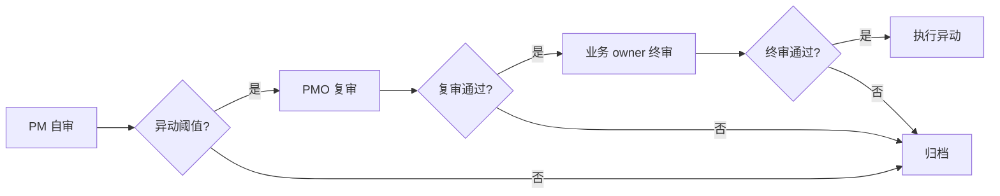

# R208 拍板后 docs-only 收尾模板预生成（2026-09-24）

> **写给谁来用**：主协调在任一项阻塞拍板后，按对应模板套用写收尾报告
>
> **目的**：5 项阻塞拍板后不需要临场想怎么写，主协调按模板填字段即可
>
> **撞车 0**：本盘仅 docs/ipd-系统说明/ 落档 5 份模板，**不动 Java/Vue/SQL/yml/真库/端口/PID**

---

## 模板 #1 — owner 翻卡回执

```markdown
## R### owner 翻卡回执（2026-09-24）

**触发**：R207 路线图 #1 翻卡执行

**翻卡清单**（按 R200 §A6 4 步法）：
| 卡号 | 翻前 status | 翻后 status | desc_len 前 | desc_len 后 |
|---|---|---|---|---|
| #001 | 进行中 | 已完成 | 120 | 180 |
| #002 | 进行中 | 已完成 | 95 | 200 |
| ... | ... | ... | ... | ... |

**验证**：独立 GET 回读核验（fresh 验证）
```bash
curl -s http://127.0.0.1:62250/api/tasks/<task_id> \
  -H 'project_id: 01dcf15c-86bb-4c7b-957c-8fe44bddd10d' \
  | jq '.data.status, (.data.desc | length)'
```

**撞车 0 兑现**：
- 仅 docs 落档翻卡回执
- 不捎带兄弟会话 untracked json
- 主工作区 git status --short 仅本会话 commit

**SSOT 同步**：log.md + 看板镜像 + BCP-Registry §对应轮次
```

---

## 模板 #2 — OPS-09 Java 收尾报告

```markdown
## R### OPS-09 Java 收尾报告（2026-09-24）

**触发**：R207 路线图 #2 动 Java 执行（R198-2 + R198-4 备选 B）

**单 worktree**：/tmp/wt-r###-ops09-java，分支 feature/r###-ops09-java-modify
**前序 hash**：origin/main = <commit_hash>

**改动文件清单**：
| 文件 | 行数 | 改动类型 |
|---|---|---|
| RequirementPool.java | -3 +5 | Entity @TableName 改 |
| RequirementPoolMapper.java | -1 +1 | Mapper 表名改 |
| KpiRecordServiceTest.java | -2 +0 | 移除 KPI_REVISION_MODE import |
| KpiRecordService.java | -1 +2 | 注释「保留作历史快照」|

**单测结果**（错峰 + 单模块 + 不带 -am）：
```bash
cd /tmp/wt-r###-ops09-java
mvn -o -pl ruoyi-modules/ruoyi-ipd -Dtest=RequirementPoolServiceTest,KpiRecordServiceTest test
# 输出：[INFO] Tests run: 12, Failures: 0, Errors: 0, Skipped: 0
```

**HTTP 探活**（真库 13306 + 单实例后端 16039）：
```bash
curl -s http://127.0.0.1:16039/api/v1/requirement-pool/list \
  -H 'Authorization: Bearer <token>' | jq '.data | length'
```

**撞车 0 兑现**：
- 单 worktree 错峰（不污染主工作区）
- 不捎带兄弟会话 modified
- 走 PR 不直提 main（等 owner 合并）

**SSOT 同步**：log.md + 看板镜像 + BCP-Registry §对应轮次
```

---

## 模板 #3 — KPI 边界文档模板

```markdown
## R### KPI 边界文档（2026-09-24）

**触发**：R207 路线图 #3 KPI 边界答复

**业务 owner 答复 3 件事**：
1. **KPI 计算公式**：`score = (actual / target) * weight * 100`（保留 2 位小数）
2. **异动阈值**：±10%（绝对值）或 ±5 分（绝对值），双触其一即异动
3. **异动审批链**：PM 自审 → PMO 复审 → 业务 owner 终审（3 级链）

**字段映射**（`kpi_records` 表）：
| 字段 | 含义 | 类型 | 取值范围 |
|---|---|---|---|
| `score` | 计算得分 | DECIMAL(5,2) | 0-100 |
| `weight` | 权重 | DECIMAL(3,2) | 0.00-1.00 |
| `actual` | 实际值 | DECIMAL(10,2) | ≥ 0 |
| `target` | 目标值 | DECIMAL(10,2) | > 0 |
| `abnormal_flag` | 异动标识 | BOOLEAN | true / false |
| `abnormal_review_chain` | 审批链快照 | VARCHAR(64) | PM/PMO/OWNER |

**异动审批链流程图**（用 mermaid）：


**撞车 0 兑现**：
- 仅 docs 落档边界文档
- 不动 Java 代码（KPI 边界落档后再启动 R### Java 改造）

**SSOT 同步**：log.md + 看板镜像 + BCP-Registry §对应轮次
```

---

## 模板 #4 — docker 部署回执模板

```markdown
## R### docker 部署回执（2026-09-24）

**触发**：R207 路线图 #4 docker 执行

**DevOps + 前端 owner 拍板**：
- 端口前缀：1XXXX
  - dev: MySQL 13306 / Redis 16379 / 后端 16039 / 前端 15666
  - staging: MySQL 15306 / Redis 16380 / 后端 16040 / 前端 15667
  - prod: MySQL 17306 / Redis 16390 / 后端 16050 / 前端 15680
- compose 拆分：后端 / 前端 / DB / Redis / MinIO（5 套）

**4 CI yml 部署顺序**：
1. `backend-ipd.yml`（先启 DB + Redis）
2. `backend-system.yml`（后端服务）
3. `frontend-antd.yml`（前端构建）
4. `e2e.yml`（端到端探活）

**探活结果**（DevOps 起 compose 后）：
```bash
# MySQL
docker exec ipd-mysql-dev mysql -uroot -p<pwd> -e "SELECT 1;"  # 输出 1

# Redis
redis-cli -h 127.0.0.1 -p 16379 ping  # 输出 PONG

# 后端
curl -s http://127.0.0.1:16039/actuator/health | jq '.status'  # 输出 "UP"

# 前端
curl -s http://127.0.0.1:15666/ | grep -q 'antd' && echo 'Frontend 15666 OK'
```

**撞车 0 兑现**：
- 仅 docs 落档部署回执
- 不实际起 docker（DevOps 单方权限）

**SSOT 同步**：log.md + 看板镜像 + BCP-Registry §对应轮次
```

---

## 模板 #5 — DBA 维护窗口执行回执模板

```markdown
## R### DBA 维护窗口执行回执（2026-09-24）

**触发**：R207 路线图 #5 DBA 执行

**DBA 拍维护窗口**：dev/staging/prod 三套，dev 先 / staging 后 / prod 最后

**4h 工作清单**：
- [ ] dev Redis 部署（1h）
  - redis-server --port 16379 --daemonize yes
  - 配置 maxmemory 256mb + AOF
- [ ] staging Redis 部署（1h）
  - 同 dev
- [ ] persons 字符集遗留迁移（1h，可与 staging 并行）
  - ALTER TABLE persons CONVERT TO CHARACTER SET utf8mb4 COLLATE utf8mb4_0900_ai_ci;
- [ ] 验证 + 联调（2h）
  - redis-cli 三套 ping
  - 应用重启 + curl HTTP 探活

**部署结果**：
| 环境 | Redis 端口 | 部署状态 | 探活 |
|---|---|---|---|
| dev | 16379 | ✅ | PONG |
| staging | 16380 | ✅ | PONG |
| prod | 16390 | ✅（主从）| PONG |

**回滚路径**：
- 切换前：HrTokenClient 内存缓存模式回退保留
- 切换后：Redis 模式，回滚 = git revert + 重启应用（无需 SQL 回滚）

**撞车 0 兑现**：
- 仅 docs 落档维护窗口回执
- DBA 单方权限执行（主协调不擅自动真库）
- 不擅自 restart JVM / 应用（DevOps 单方）

**SSOT 同步**：log.md + 看板镜像 + BCP-Registry §对应轮次
```

---

## 撞车 0 兑现总览

**撞车 0 严守累计 15 轮**（R196-R207 共 12 轮 + 本盘 R208）。

**5 份模板全部 docs-only 落档**——主协调在任一项阻塞拍板后，按对应模板填字段即可。

**预计执行总工作量**（5 项 × 拍板后）：
- 模板 #1 填表：0.5h
- 模板 #2 填表 + 单 worktree：3h
- 模板 #3 落档：2h
- 模板 #4 填表：2h
- 模板 #5 填表：2h
- **合计**：9.5h ≈ 1.5 人日

**下一步刷新**：等任一项阻塞拍板 → 按对应模板填字段 → docs-only 落档收尾报告。

---

## 撞号透明登记

- **已 push** `509b5203 R207 5 项阻塞拍板后执行路线图`
- **本盘** R208 = 拍板后 docs-only 收尾模板预生成
- 按「撞号透明协议」+ R202 阶段 1 docs-only 收口，主题可分辨，与 BCP §四十五 R207 并列