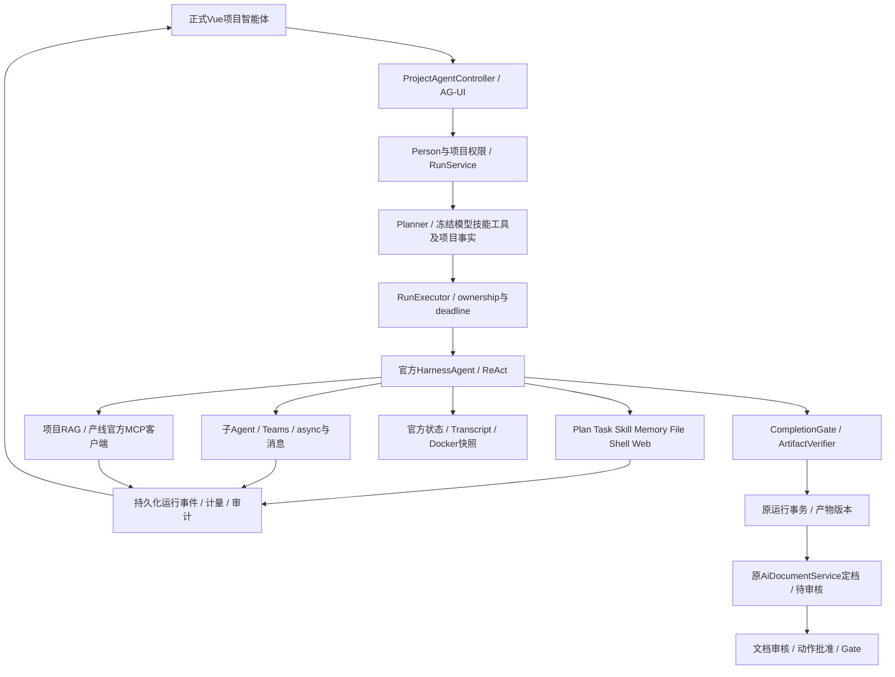

# AgentScope 全技术栈与 IPD 项目链路审计

生成时间：2026-10-03 01:56 PDT。来源：当前源码、本机官方源码与 2.0.3 sources.jar、磁盘候选 JAR、监听进程、开发库只读查询、已有测试报告。三个专业审查并行只读，主审统一复核。

**裁决：部分闭环（PARTIAL）。不能认定本项目完整应用了全部官方能力，也不能认定全项目生产就绪。**

当前项目已深入使用官方 Core/Harness，真实接线包括计划、任务、技能管理/晋升/整理、子智能体、Teams、Docker 沙箱、状态存储、记忆、AG-UI、权限扩展和产物交付。历史“全部禁开”的记录不代表现码。但存在已确认的故障降级、记忆计量旁路、有限 MCP 协议覆盖、有限质量合同，以及源码/编译产物/运行候选不一致。

本文件是原 R242、W0–W8、U0–U2、G1–G3 的审计附件与待办细化，**不是第二份任务状态源**。执行顺序仍以 `/Users/mac/.cursor/projects/Users-mac-Documents-ruoyi-ipd-web/canvases/ipd-execution-plan.canvas.tsx` 为准；事项、allowedPaths、认领仍登记到 `docs/ipd-系统说明/开发计划-看板镜像.md`。本轮没有修改业务代码、SQL、权限、计划状态，没有提交、推送、重载或创建业务运行。

## 1. 审计边界和证据等级

- 前端：`/Users/mac/Documents/ruoyi-ipd-web`，正式 Ant Design Vue 前端。
- 后端：`/Users/mac/Documents/ruoyi-ai`，IPD、chat、aiflow 及共享官方适配。
- 官方参考：`/Users/mac/Documents/agentscope-java`。不把 IAP 或其他产品带入本次结论。
- A 级证据：当前文件、JAR 内容和类字节、接口响应、只读数据库结果。
- 已有收口报告和旧测试结果仅说明当时事实；本轮没有重新运行构建、测试、登录业务旅程、模型调用或浏览器操作。
- 不提供“完成百分比”：官方能力、互斥 provider、业务动作和运行场景不能混为一个分母。
- 本次语义检索返回 `Failed to open zvec collection storage`，随后使用精确 rg 与定点读取；没有创建或重建索引。

## 2. 版本、候选和运行态基线

| 项 | 本轮实查 | 判断 |
|---|---|---|
| 官方 HEAD | `e9721285c63a37c10b1d07aa540408e57ba56ab2`，工作区干净 | 官方根 POM revision 为 `2.0.4-SNAPSHOT`，不是项目 SDK 版本 |
| 后端 HEAD | `67cd2b50e082a0340c2f6074cf006e52e53e6dab`，大量 tracked/untracked 在途变更 | HEAD 不能完整表示本轮源码 |
| 项目 SDK | 根 POM `agentscope.version=2.0.3` | 所有 API/行为先按真实 2.0.3 核验 |
| 后端监听 | Java PID `58389`，`127.0.0.1:16039`，打开 `ruoyi-admin/target/ruoyi-admin.jar` | 仅证明本机服务在监听；不是生产验收 |
| 前端监听 | Node PID `38773`，`127.0.0.1:15666` | 未执行页面行为验收 |
| 磁盘候选 SHA-256 | `76b38bb7f828cd38d54d05ebcd22bd11d0ba90dcd251ce2ad9b8cce8084cac07`，mtime `2026-10-03 01:12:22 PDT` | 路径与进程打开路径一致；不将所有已加载内存类与当前磁盘字节等同 |
| 类字节比较 | Kernel、LTM Middleware、LTM 实现、ArtifactVerifier、RunHandle：嵌套 JAR 与当前 target 相同；RunService、RunExecutor：不同 | 当前 target 不是完整运行候选，同版本联合验收前必须重新固定基线 |
| 未认证接口 | `GET /api/v1/auth/me` → HTTP 401，`code=20001` | 鉴权边界存在，不能代替真实 Person 权限旅程 |
| 开发库运行分布 | CANCELLED 3、FAILED 14、SUCCEEDED 47、VERIFYING 2、WAITING_APPROVAL 2 | 混合历史运行；不能作为本轮成功率 |
| 开发库记忆 | 候选态 `status=0` 共 8 行；run `2106300308379406337` 共 8 行 | 有真实持久化，但不证明候选已获批准/可作为业务事实 |

磁盘候选含十件 `io.agentscope` 2.0.3 JAR：core、harness、model-anthropic、model-ollama、model-dashscope、model-openai、redis、mysql、rag-simple、agui。源码 POM 还声明 Gemini，但本候选未出现其 JAR，须查依赖解析/打包差异；不能按 POM 宣称已加载。

已有 Surefire 报告仍有失败：ShutdownConfiguration 3 项/1 error、AguiProtocol 13 项/1 failure、SchedulingCronContractSentinel 3 项/1 failure，报告时间约 01:07–01:08 PDT。它们不是本轮重跑结果，不据此断言当前源码必失败，也不能称全量绿。

### 对已有收口报告的校正

`AgentScope官方能力全量启用-四项收口-20261003.md` 记载 run `2106272487481290754` 为 ARCHIVED；本轮 `ipd_agent_run.status` 回读为 **SUCCEEDED**。应区分运行主状态、产物定档状态、沙箱归档事件，不将三者混用。该报告记忆 4 行，本轮回读为 8 行，需按时间及 source_digest 解释新增/重复抽取，不直接认定重复故障。

run `2106296461246337026`、`2106300308379406337` 当前均 VERIFYING。当前源码已经有 `reverify()`，所以不能称“完全无出口”；但该 RunService 与候选包字节不同，尚不能宣称出口已加载并验收。

## 3. 官方技术栈全景及应用判断

官方根模块为 core、harness、service、extensions、examples、dependencies-bom、distribution。Examples 是演示，BOM/Distribution 是版本与打包治理，不能当作业务能力完成项。

| 层 | 官方能力族 | 项目当前情况 | 后续判断 |
|---|---|---|---|
| Core 执行 | ReAct、Agent/RuntimeContext、Msg/ContentBlock、事件流、Model/Tool SPI、中断/取消 | 项目 Kernel 实际使用官方 streamEvents、状态与事件 | 源码已接；正常/失败/恢复需运行验收 |
| Core 扩展 | Middleware、Hooks、三态权限/HITL、Tracing、结构化输出/多模态 | 官方扩展点挂业务权限、ownership、deadline、审计；OTel middleware 已挂 | 不属于擅自重写官方内核；具体兼容和 exporter 待验 |
| Harness 上下文 | Workspace、短期状态、Transcript、session/history/search、Compaction、工具结果外置、工作记忆 flush/consolidation | 官方配置与业务包装存在 | 长上下文触发、隔离、脱敏、持久化和重启待验 |
| Harness 自主执行 | PlanMode、TaskList、MetaTool、PendingToolRecovery | Kernel 显式开启 | 不能再按旧禁开口径判未接；启用不等于调用过 |
| Harness 技能 | 渐进加载、SkillManage、Curator、PromotionGate、仓库资源与可见性 | 已用官方仓库、冻结快照、管理/晋升扩展 | owner 审核、发布、随后运行采用需完整旅程 |
| Harness 多智能体 | spawn/list/send、递归子任务、Teams、message bus、async registry | 真实 child consumers、lineage、LocalTeamClient、Redis store 接线 | 本地消费者存在；跨进程/崩溃/递归恢复待验 |
| Harness 基础工具 | File/Shell/Web、记忆/会话、计划、任务、技能和产物工具 | 原生工具编号表与工具配置存在，Docker 官方 provider 接入 | 实际运行 Toolkit 枚举及每种工具消费必须验收 |
| Harness 沙箱/交付 | Docker、snapshot take/restore/release、ArtifactDeliveryTarget | Docker SESSION 隔离、快照观察器、业务交付 provider | 缺 daemon/镜像明确失败；冷恢复/receipt/最终清理待验 |
| MCP | 官方客户端、工具 schema/注册、协议生命周期 | 产线知识走官方传输，但适配仅单工具、必填字符串查询 | 不是完整通用 MCP；复杂 schema/resources/prompts 待补覆盖 |
| 知识/RAG | 官方应用层接入方向；外部 RAG provider | 项目应用层 RAG，文档与知识来源权威回读 | 方向符合官方；故障语义全入口未统一 |
| 长期记忆 | 旧 LongTermMemory 接口、v2 middleware 方向、外部 provider | 自有库实现官方接口并挂 middleware | 有落库；计量旁路、吞错及异步 receipt 未闭合 |
| 模型 provider | OpenAI/官方 OpenAI 客户端、Anthropic、Gemini、DashScope、Ollama | 多扩展声明；实际项目主模型经适配器，候选十件如上 | 不以依赖存在证明 MiniMax 全协议兼容；备用切换待验 |
| 持久化 provider | Redis/MySQL/PostgreSQL/JDBC/MongoDB/OSS/COS | 当前主要 Redis/MySQL 与本地受控文件 | 其余是可替换 provider，未应用不自动等于缺陷 |
| 协议扩展 | AG-UI、A2A、Chat Completions Web、Agent Protocol | AG-UI 已接；其他未见同等生产入口证据 | AG-UI 要协议/回放验收；其他须确认业务消费者 |
| 技能/配置发现 | Git/MySQL/PostgreSQL skill repository、Nacos A2A/Prompt/Skill | 项目批准技能仓/目录包装；未接全部外围仓和发现平台 | 不新建第二目录，按明确场景选官方扩展 |
| 外部记忆/RAG | Mem0/百炼/ReMe；百炼/Dify/RagFlow/Haystack/Simple | 现有应用链/本地化实现，未全接每一家外部服务 | 各厂商实现不是同时必须开启的业务能力 |
| 调度/渠道 | Quartz/XXL-Job；钉钉/飞书/GitHub/GitLab/企微/微信 | 未见所有渠道和官方 scheduler 生产消费者 | 要列出“不适用/需求待确认/必须接入”，不能虚报全用 |
| 云沙箱 | Kubernetes/AgentRun/Daytona/E2B | 当前 Docker；未见全部云 provider 接入 | 属部署选择；不能因未接 E2B 判 Docker 不官方 |
| 评测/运营 | Studio、Judge/JEV、Training、Higress、Aistio | 未见全部官方外围运营链应用证据 | 内容评测/观测目标必须有实现，具体产品接入按场景 |
| Service | common/gateway/dataplane/scheduler，独立托管控制面和分布式运行体系 | IPD 嵌入 SDK；servicebridge 是应用适配，不证明部署完整官方 Service | 必须单独判范围、版本、部署与验收，不能借名称宣称全 Service 已应用 |

“官方全能力”应检查每一种适用能力的实际消费者和可靠性，而不是把所有互斥模型/数据库/云 provider 一并安装。当前未采用的外围模块全部在附录枚举；是否进入执行范围须回原总计划裁决，不能默认降为可永久不做。

## 4. 实际项目端到端链路



官方负责推理/工具/状态/协作执行；IPD 仍拥有业务身份、审核、动作、Gate、并发、幂等和事务权威。`ProjectAgent*` 应用包装不是天然偏离；判断标准是是否使用官方扩展点、是否破坏语义、是否有旁路或第二权威。

副驾、文档生成、Gate 预审等需逐入口审计，不能以项目智能体一次通过代表全部 AI 入口通过。旧 WorkflowEngine 是否已退场必须查当前包、路由和调用，不沿历史记忆直接断言仍在运行。

## 5. 已确认缺口与偏离

下列路径相对后端根；行号是本轮读到的快照，在途编辑后应按符号定位。

### 5.1 记忆模型旁路、吞错和异步完成

- `agent/kernel/AgentScopeProjectAgentKernel.java:432–437`：先把原始 `model` 注入 LTM，之后才构建 `ProjectAgentMeteredModel`。
- `agent/kernel/ProjectScopedLongTermMemory.java:185`：抽取直接调用 `model.stream`，未经过主链计量包装的 MODEL_CALL、usage 和 ownership 检查。注释“同账”与实现相反。
- 同文件 `125–128`、`146–149`：失败只 WARN 后 `Mono.empty()`，故障和正常无记忆无法由运行事件区分。
- `ProjectAgentLongTermMemoryMiddleware.java:90`：`record(...).subscribe()` 不等待持久化回执。主运行成功不能证明记忆落库完成，退出/撤权/晚写有待独立验证。
- 8 条候选记忆存在只证明部分持久化；记忆召回查询是否使用问题、候选晋升/撤回/遗忘及隔离需另外验收。

这是真实实现缺口，优先修统一治理与结构化失败状态；不把记忆提升为业务事实或审批权威。

### 5.2 Hook 根因说明与官方不符

`ProjectAgentLongTermMemoryMiddleware.java:22–26` 及 Kernel 的 LTM 注释声称 2.0.3 父 Harness Hook 不接线。实际读 2.0.3 sources.jar 内 `HarnessAgent.java:1568–1572`：

```java
hooks.add(hook);
inner.hook(hook);
```

参考仓当前源码同样如此。本候选嵌套 harness JAR 与本机 2.0.3 Maven JAR 字节相同，SHA `e6f6f5c39d8e16ca5c2ea3727b56dbcfa8fd408ef54a0018c0c9416251beb1a0`。这推翻了“Builder 只接子工厂”的源码解释，不足以单独证明实际 hook 的每条分发路径都正确。应纠正错因并测试父/子正常、失败、取消、暂停、续跑分发；middleware 可以保留，但理由和必要性要真实。

### 5.3 备用模型 fail-open

Kernel `assembleFallback` 异常被捕获为 `FALLBACK/SKIPPED` 并继续主模型。必须区分未配置、合法主备策略、已配置但装配失败、调用中真实切换。官方提供 fallback 不代表项目可以隐瞒能力失败；应对“禁止降级”目标建立显式策略、模型身份和计量事件，不编造备用模型行。

### 5.4 MCP 覆盖有限

`ProductLineMcpQuery.java:165–171` 要求仅一个协议工具且仅必填字符串参数；`ProductLineMcpTool.java:33–35` 不走通用 registration，包装为受控查询工具。它已用官方客户端，不能称手写传输未替换；但通用多工具、复杂参数、resources/prompts、取消/lifecycle 不能算完整应用。展示名不能成为知识来源闸门，服务标识和业务授权仍需保留。

### 5.5 RAG 只在部分入口严格处理故障

续接源码核验更正：以上早期“宽松入口异常返回 EMPTY”口径已过时。当前 `AiDocEmbeddingService.retrieveContext` 已把运行故障包装为明确业务错误，副驾及生成仍调用原同链；尚未完成的是坏向量、维度不一致及零向量被静默过滤，全部损坏时仍表现无结果，部分损坏缺少部分成功说明；已审核但未索引也未与合法无匹配区分。源码与原专测内容已核，尚不将此更正视为最新包加载或全检索五态验收。

官方 `Knowledge`/旧 RAG API 明确弃用并指向应用层集成，所以没有使用旧 GenericRAGHook **不是漏接**；不能为了全量制造第二 RAG 链。

### 5.6 质量门不等于事实与动作验收

- `ProjectAgentArtifactVerifier.java:71–87` 仅通用标题和占位标记，动作规则 `Map.of()` 为空。
- 单个占位词仍通过；两次才拦。适用性必须按文档类型/短回答/动作合同决定，不能把所有输出强行 Markdown 化。
- `ProjectAgentCompletionGate.java` 的文本规则只核有限数字模式（小数/百分比等），不是逐事实核证，整数/年份/单位/型号及跨来源因果不能据它宣称正确。
- 机器规则通过、运行成功、文档待审核、动作确认和 Gate 放行是不同层级，必须保留业务人工批准。

### 5.7 恢复是部分恢复，不是任意步骤无损续跑

`ProjectAgentRunRecovery.java:24–70` 有 AG-UI intent 原运行恢复；普通 PENDING/RUNNING/CANCEL_REQUESTED 的部分路径安全收口 INTERRUPTED/FAILED/CANCELLED，并提示另开尝试。安全收口有价值，但不能算外部效果 exactly-once 或任意节点原位恢复。

正常 RunHandle 完成事务已有 CAS/事件/产物同收口。另一方面，RunService `reverify` 的 `finishVerifying` 先迁移状态，再写终态事件，事件重试耗尽只 WARN `EVENT_UNRESOLVED`；源码自身说明可能“终态无终态事件”。应核事务边界、持久化补偿/对账消费者。SDK 状态提交后清理失败也只留 UNRESOLVED 日志，尚未证明可恢复对账闭环。

### 5.8 基础能力与部署覆盖仍待实证

官方 Docker provider 使用 network none、SESSION 隔离、`--pull=never`、cap-drop，不回主机 Shell。受控网络不是自动等于 Web 被禁：应分别核 `web_fetch/web_search` 的真实 provider 与执行位置、配置、出站批准和失败行为。当前镜像写死 `python:3.13-alpine`，需核是否满足已授权 Coding 场景依赖；不能以 Shell 工具存在表示所有技术栈都能执行。

OTel middleware 已挂，但 SDK/exporter 未配置时可为 no-op。Teams 当前是 LocalTeamClient 加 Redis/工作区协作，不等于完整分布式 Service 控制面。各自必须有消费者、持久化、失败与恢复证据。

## 6. 完整后续待办：依赖顺序、验收与归属

以下编号仅为本附件引用键；不建新卡、不代替原事项。优先级表示执行风险；所有已纳入用户全能力合同的项目都必须交付，不以 P1/P2 排序逃避实施。

| 编号 / 原计划归属 | 后续工作 | 通过标准 |
|---|---|---|
| A01 P0 / W0,G2 | 固定前后端源码快照、dirty 清单、2.0.3依赖与sources、候选SHA、类/资源清单、进程打开包 | 同一份 manifest 可追溯 source→class→嵌套JAR→PID；解释 Gemini 声明与候选缺件 |
| A02 P0 / W0 | 逐项比对官方2.0.3与参考2.0.4-SNAPSHOT，核子agent pending修复等版本差异 | 每个采用API均有目标版本证据；新增能力有兼容合同，不混版本 |
| A03 P0 / W0 | 总计划、AGENTS、ADR旧禁开、当前实现及全启用目标统一 | 所有入口对同能力只有一个现行合同；运行上下文检查通过，不改业务审批 |
| A04 P0 / W7,G1 | 修复或重新核当前全量报告失败，随后统一串行构建 | 实际发现/执行测试数量和skip披露；type/build无TS诊断；不靠放宽断言假绿 |
| A05 P0 / W7 | LTM抽取接统一模型治理/计量/ownership/deadline | 主调用、抽取、压缩、子调用和备用切换均有同账事件；撤权/过期租约阻断新调用 |
| A06 P0 / W7 | LTM成功、无结果、失败分开，持久化receipt与有界恢复 | DB拒绝/超时/服务退出不被包装成功空值；完成证据可回读、可幂等对账 |
| A07 P0 / W7 | 核父子Hook分发，纠正“父Hook死路”根因说明 | 同版本正常/异常/取消/暂停/续跑实证；middleware理由与真实调用相符 |
| A08 P0 / W1,W7 | 已配置fallback装配失败明确报错；真实主备切换合同 | 故障注入能回读主/备身份、切换原因、用量和用户可见状态；无静默功能降级 |
| A09 P0 / W4 | 全AI入口检索故障语义统一 | 副驾/生成/智能体/Gate等逐入口区分故障、部分命中、无结果、无权；错误不冒充无资料 |
| A10 P0 / W8,G1 | VERIFYING修复/复检/取消/成功路径完整接线并加载 | 两驻留样本按合法流程可回读；状态、终态事件、产物版本一致；浏览器入口可用 |
| A11 P0 / W8 | reverify终态CAS、事件、需求回写持久化合同 | 在CAS后事件失败、竞争取消、重复复检下无永久无事件终态；补偿不重复业务写入 |
| A12 P0 / W7,W8 | 完成后checkpoint/沙箱清理对账 | 清理失败留可持久化任务，冷启动可恢复；终态不重复执行原副作用 |
| A13 P0 / G1,G3 | 同候选真实Person最小全旅程 | 意图→澄清/计划→调用→产物→定档→审核/动作批准/Gate→刷新回读，按实际授权参与人完成 |
| A14 P1 / W1 | 主模型provider兼容：stream/tools/结构化输出/多模态/error/usage | 真实MiniMax与当前适用模型合同测试；不以依赖已装当协议完整 |
| A15 P1 / W2,W7 | 运行实际Toolkit与基础工具全清单 | 逐File/Shell/Web/记忆/会话/计划/任务/技能/交付调用成功、权限拒绝和错误事件；缺provider明确失败 |
| A16 P1 / W7 | Docker镜像/依赖与Coding场景完整运行 | 授权项目所需构建执行可复现；缺daemon/镜像不回主机，超时取消无泄漏 |
| A17 P1 / W7 | snapshot take/restore/release和SESSION隔离 | 写入→snapshot receipt→冷恢复内容一致→归档清理；并发/失败不串run、不丢文件 |
| A18 P1 / W7 | 长上下文compaction/结果外置/flush/consolidation | 真正达到阈值，有摘要/外置文件/出处与用量；关键信息保留，故障不静默截断 |
| A19 P1 / W7 | 三层记忆、session历史、搜索的权威与隔离 | 跨人/跨项目/撤权反例；候选晋升/撤回/遗忘可追溯，工作笔记不变审批依据 |
| A20 P1 / W2,W7 | 官方渐进技能发现/加载/资源staging | 已批准技能资源真被调用；快照SHA篡改拒绝，classpath多层fat JAR真实加载通过 |
| A21 P1 / W2,W7 | SkillManage→propose→owner审核→promotion→下一次采用 | 当前run不得自动升权；草案、批准版本与下一运行冻结快照一致 |
| A22 P1 / W7 | PlanMode/TaskList/MetaTool真实消费者 | enter/write/exit ASK→原调用恢复；todo持久化和装备工具变化可回读，计划不冒业务批准 |
| A23 P1 / W7 | 子Agent递归执行完整合同 | 模型/技能/工具/产物同治理；深度上限、失败传播、暂停批准、再次ASK与原child续跑通过 |
| A24 P1 / W7 | Teams/message bus/async registry跨进程持久化 | inbox/task/output可消费；重启、重复消息、stale owner、未消费子结果均无串scope或丢结果 |
| A25 P1 / W5 | 当前每个产线MCP initialize/listTools/callTool链 | 真实服务逐项带协议工具名和来源，取消/超时/认证失败明确；展示名不同仍按服务绑定 |
| A26 P1 / W5 | 多工具/复杂schema/resources/prompts覆盖矩阵与接入 | 适用场景经同一官方客户端和治理注册；不另造JSON-RPC/第二工具编号轨 |
| A27 P1 / W4 | 文档/知识RAG权限、索引和查询一致 | 撤销审核/删除/失效fragment/陈旧向量/同名附件/混合库失败反例；出处回权威记录 |
| A28 P1 / W4 | 嵌入模型维度/版本/索引规模验证 | 当前授权嵌入配置一致；1024维及模型名回读；规模性能与失败明确，不造READY |
| A29 P1 / W3,W7 | 全工具permission DENY/ASK与运行期撤权 | 原生/SDK生成/子/front-end schema工具统一保护；冻结/撤权/租约交接即时阻断 |
| A30 P1 / W8 | ArtifactDeliveryTarget与原文档业务事务完整合同 | 文件/文本hash、版本、幂等、receipt、并发apply、下载权限与原审核链一致 |
| A31 P1 / W8 | 动作级质量合同落地 | 按49页/DOC/原动作合同配置章节/适用条件/必填事实；owner裁决项不编造 |
| A32 P1 / W8,G1 | 事实核证超出有限正则 | 整数/年份/单位/型号/金额/百分比逐断言关联出处；明确未知和冲突，保留人工审核 |
| A33 P1 / W7,G1 | 全故障点恢复矩阵 | 独立进程杀点：模型后/写库前、checkpoint前后、consume后/调度前、子完成/父消费前，合法原位恢复或显式新尝试 |
| A34 P1 / W8,G1 | 外部效果幂等与对账 | DB与外部调用间故障不重发、不冒成功；SDK pending恢复不被当exactly-once证明 |
| A35 P1 / W6 | trace/日志/OTel真正输出与关联 | 配真实SDK/exporter，父子span、模型/工具/MCP/DB/runId可关联；BUILD故障有脱敏原因和栈 |
| A36 P1 / W6,W7 | transcript/记忆/产物/日志敏感信息控制 | 测试密钥和内部推理反例，无原始内部推理长期保存；脱敏与存储ACL实证 |
| A37 P1 / U1,G1 | AG-UI协议与前端run/事件回放合同 | 官方事件/自定义持久化投影、字符串ID、SSE cursor、断线/分页/终态不丢事件；不能只按枚举替换验收 |
| A38 P1 / U1,G1 | 真实浏览器中断/重试/刷新/身份切换 | 双击、过期interrupt/pauseSeq、两标签、退出登录/Person切换、WAITING/VERIFYING、apply权限与后台不取消通过 |
| A39 P1 / W8,U2 | 全AI入口和旧路径退役实查 | 当前jar/config/router/menu/call日志逐入口归属清楚；不将副驾当项目智能体、不保留第二run/文档轨 |
| A40 P1 / G2,G3 | 原规格全域与生产就绪验收 | 49页/249AC/105BR、六阶段/22小阶段/69动作按已有合同映射验证；不是一次C01/C02样本推广 |
| A41 P2 / W0,W7 | 外围官方扩展逐模块应用边界 | 附录每项标记适用能力/替代provider/版本不可用/待纳入；不能把未用统称完成或全部无关 |
| A42 P2 / W7 | Service分布式控制面范围与完整性 | 若总合同纳入，独立版本、部署拓扑、身份、调度、资源/secret、恢复和治理验收；嵌入SDK不冒充完整Service |
| A43 P2 / W6,G1 | Judge/评测/训练/Studio等运营需求落实 | 质量评测与监控有真实消费者、数据合同与验收；不用产品名或空Bean代替能力 |
| A44 P2 / G2 | 可复现交付与演练 | fresh checkout包含必要untracked闭包，依赖锁/构建/配置/DDL授权及回滚演练可复核；生产操作另按授权 |

依赖建议：A01–A04 → A05–A12 → A13 最小联合旅程；A14–A39按原分区实施并回同一候选；A40/A44最终验收。A41/A42先确定适用范围，已明确属于合同的外围能力不等待核心通过才开始设计。构建、target、候选包、端口、计划回写仍只有一个写入者。

## 7. 审计完成与实现完成分开

本轮审计已交付覆盖矩阵和待办；实现状态仍 PARTIAL。没有新构建、模型故障注入、Person写入、浏览器验收、恢复演练或生产操作，因此上表运行验收全部不得自动勾完成。

允许据本报告裁决的是：当前源码确有官方深度接线；记忆计量旁路/吞错、备用装配fail-open、MCP覆盖限制、空动作规则、部分RAG入口吞错和候选类不一致均有直接证据。不能据本报告裁决的是：全部provider可用、所有工具正确、全部业务动作闭环、整个旧引擎已退场、全量测试通过、完整官方Service部署或生产就绪。

## 8. 关键证据导航

- 官方：`/Users/mac/Documents/agentscope-java/pom.xml`、`agentscope-extensions/pom.xml`、各子聚合POM、`agentscope-service/pom.xml`。
- 官方主能力：`agentscope-harness/src/main/java/io/agentscope/harness/agent/HarnessAgent.java`；`agentscope-core/src/main/java/io/agentscope/core/rag/Knowledge.java`；`core/memory/LongTermMemory.java`。
- 同版本证据：`/Users/mac/.m2/repository/io/agentscope/agentscope-harness/2.0.3/agentscope-harness-2.0.3-sources.jar`。
- 项目主链：`ruoyi-modules/ruoyi-ipd/src/main/java/org/ruoyi/ipd/agent/{config,kernel,service,servicebridge}`。
- 前端：`apps/web-antd/src/views/ipd/_shared/ai-agent/use-project-agent-run.ts`、`src/api/ipd/project-agent-agui.ts`、`project-agent.ts`。
- 原计划：总画布、后端 `docs/ipd-系统说明/开发计划-看板镜像.md` 原 R242/W/G/U 节。
- 既有报告：`docs/ipd-系统说明/验收/AgentScope官方能力全量启用-四项收口-20261003.md`，只作需对账的历史记录。


## 附录：官方扩展叶模块逐项清单

此表直接解析官方当前HEAD的聚合POM，避免仅按README列举遗漏。它反映2.0.4-SNAPSHOT目录及本项目2.0.3候选的对应关系；未打包不是自动缺陷，也不是证明源码从未使用，版本是否存在需A02核验。Spring Boot starter可被手工Bean装配替代，不要求同时接入。

| 官方叶模块 | 本项目候选/声明证据 |
|---|---|
| `agentscope-extensions-aistio` | 本候选未打包，未建立项目消费者证据 |
| `agentscope-extensions-channel-common` | 本候选未打包，未建立项目消费者证据 |
| `agentscope-extensions-channel-dingtalk` | 本候选未打包，未建立项目消费者证据 |
| `agentscope-extensions-channel-feishu` | 本候选未打包，未建立项目消费者证据 |
| `agentscope-extensions-channel-github` | 本候选未打包，未建立项目消费者证据 |
| `agentscope-extensions-channel-gitlab` | 本候选未打包，未建立项目消费者证据 |
| `agentscope-extensions-channel-wecom` | 本候选未打包，未建立项目消费者证据 |
| `agentscope-extensions-channel-weixin` | 本候选未打包，未建立项目消费者证据 |
| `agentscope-extensions-cos` | 本候选未打包，未建立项目消费者证据 |
| `agentscope-extensions-higress` | 本候选未打包，未建立项目消费者证据 |
| `agentscope-extensions-jdbc` | 本候选未打包，未建立项目消费者证据 |
| `agentscope-extensions-jev` | 本候选未打包，未建立项目消费者证据 |
| `agentscope-extensions-mem0` | 本候选未打包，未建立项目消费者证据 |
| `agentscope-extensions-memory-bailian` | 本候选未打包，未建立项目消费者证据 |
| `agentscope-extensions-reme` | 本候选未打包，未建立项目消费者证据 |
| `agentscope-extensions-model-anthropic` | 本候选已打包（调用待验） |
| `agentscope-extensions-model-dashscope` | 本候选已打包（调用待验） |
| `agentscope-extensions-model-e2e-tests` | 官方测试模块，不作业务能力 |
| `agentscope-extensions-model-gemini` | 项目POM声明，候选未打包 |
| `agentscope-extensions-model-ollama` | 本候选已打包（调用待验） |
| `agentscope-extensions-model-openai` | 本候选已打包（调用待验） |
| `agentscope-extensions-model-openai-official` | 本候选未打包，未建立项目消费者证据 |
| `agentscope-extensions-mongodb` | 本候选未打包，未建立项目消费者证据 |
| `agentscope-extensions-mysql` | 本候选已打包（调用待验） |
| `agentscope-extensions-nacos-a2a` | 本候选未打包，未建立项目消费者证据 |
| `agentscope-extensions-nacos-prompt` | 本候选未打包，未建立项目消费者证据 |
| `agentscope-extensions-nacos-skill` | 本候选未打包，未建立项目消费者证据 |
| `agentscope-extensions-oss` | 本候选未打包，未建立项目消费者证据 |
| `agentscope-extensions-postgresql` | 本候选未打包，未建立项目消费者证据 |
| `agentscope-extensions-a2a-client` | 本候选未打包，未建立项目消费者证据 |
| `agentscope-extensions-a2a-server` | 本候选未打包，未建立项目消费者证据 |
| `agentscope-extensions-agent-protocol` | 本候选未打包，未建立项目消费者证据 |
| `agentscope-extensions-agui` | 本候选已打包（调用待验） |
| `agentscope-extensions-chat-completions-web` | 本候选未打包，未建立项目消费者证据 |
| `agentscope-extensions-rag-bailian` | 本候选未打包，未建立项目消费者证据 |
| `agentscope-extensions-rag-dify` | 本候选未打包，未建立项目消费者证据 |
| `agentscope-extensions-rag-haystack` | 本候选未打包，未建立项目消费者证据 |
| `agentscope-extensions-rag-ragflow` | 本候选未打包，未建立项目消费者证据 |
| `agentscope-extensions-rag-simple` | 本候选已打包（调用待验） |
| `agentscope-extensions-redis` | 本候选已打包（调用待验） |
| `agentscope-extensions-sandbox-agentrun` | 本候选未打包，未建立项目消费者证据 |
| `agentscope-extensions-sandbox-daytona` | 本候选未打包，未建立项目消费者证据 |
| `agentscope-extensions-sandbox-e2b` | 本候选未打包，未建立项目消费者证据 |
| `agentscope-extensions-sandbox-kubernetes` | 本候选未打包，未建立项目消费者证据 |
| `agentscope-extensions-scheduler-common` | 本候选未打包，未建立项目消费者证据 |
| `agentscope-extensions-scheduler-quartz` | 本候选未打包，未建立项目消费者证据 |
| `agentscope-extensions-scheduler-xxl-job` | 本候选未打包，未建立项目消费者证据 |
| `agentscope-extensions-skill-git-repository` | 本候选未打包，未建立项目消费者证据 |
| `agentscope-extensions-skill-mysql-repository` | 本候选未打包，未建立项目消费者证据 |
| `agentscope-extensions-skill-postgresql-repository` | 本候选未打包，未建立项目消费者证据 |
| `agentscope-extensions-studio` | 本候选未打包，未建立项目消费者证据 |
| `agentscope-extensions-training` | 本候选未打包，未建立项目消费者证据 |
| `agentscope-a2a-spring-boot-starter` | 本候选未打包，未建立项目消费者证据 |
| `agentscope-admin-spring-boot-starter` | 本候选未打包，未建立项目消费者证据 |
| `agentscope-agui-spring-boot-starter` | 本候选未打包，未建立项目消费者证据 |
| `agentscope-anthropic-spring-boot-starter` | 本候选未打包，未建立项目消费者证据 |
| `agentscope-chat-completions-web-starter` | 本候选未打包，未建立项目消费者证据 |
| `agentscope-dashscope-spring-boot-starter` | 本候选未打包，未建立项目消费者证据 |
| `agentscope-gemini-spring-boot-starter` | 本候选未打包，未建立项目消费者证据 |
| `agentscope-jev-spring-boot-starter` | 本候选未打包，未建立项目消费者证据 |
| `agentscope-nacos-spring-boot-starter` | 本候选未打包，未建立项目消费者证据 |
| `agentscope-ollama-spring-boot-starter` | 本候选未打包，未建立项目消费者证据 |
| `agentscope-openai-spring-boot-starter` | 本候选未打包，未建立项目消费者证据 |
| `agentscope-spring-boot-starter` | 本候选未打包，未建立项目消费者证据 |

Service叶模块：`service-common`、`service-gateway`、`service-dataplane`、`service-scheduler`。当前未建立完整部署这四个官方服务的证据；项目servicebridge不能据名称等同这些模块。
