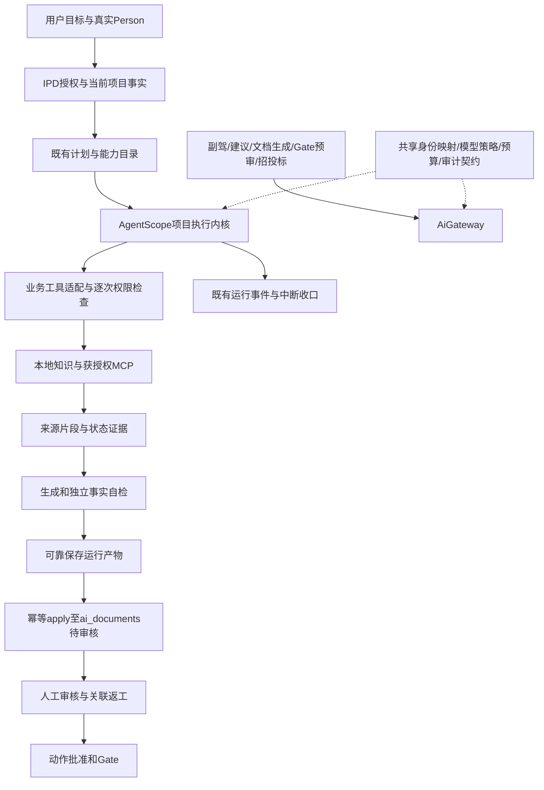
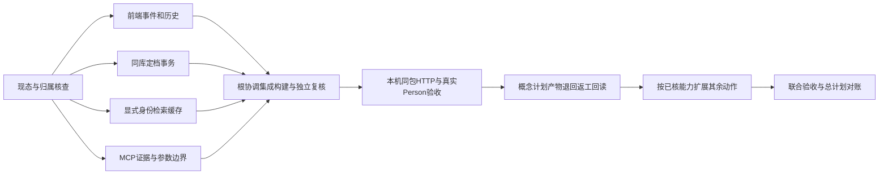

# RuoYi IPD 全项目 AI 优化设计与后续计划

日期：2026-10-01（用户时区）。性质：研究与实施设计，不是完成证明。总体裁决：**部分闭环；保留业务架构主干，优先修复可信执行链，当前不能认定为最佳实现或生产就绪。**

本文件汇总用户提供的两份研究附件、WorkBuddy 九份交付、Doubao HTML 审计，以及本轮源码、协议、数据库历史快照和局部测试。执行状态仍以 `开发计划-看板镜像.md`、R242 和既有唯一执行画布为准。本文件不另建任务状态源，不把研究完成标成业务完成。

## 1. 结论与证据边界

合理的部分是：IPD 六阶段、动作、Person 身份、审核、负责人批准和 Gate 由业务服务控制；项目智能体负责分析、检索、生成和自检。应保留独立 ProjectAgentController 运行入口，保留副驾等既有 AiGateway 入口，复用横向治理，不把不同产品入口强制合成同一个智能体循环。

当前最重要的问题是四条链尚未完整闭合：

1. 项目事实到授权知识源的选择，尚缺当前运行接入和真实查询证明。
2. 检索成功到事实正确之间，缺少逐项引用、数字忠实度和失败语义保障。
3. 运行成功到产物可靠保存、幂等定档之间，存在源码可见的顺序与事务风险。
4. 历史可查询到中断可收口、事件完整展示之间，缺少恢复与分页排空验证。

已知运行 `2105858033761505281` 的 SOURCE 命中海康威视.md，原句含研发费用率 12.83%，可证明这次知识命中；不能据此证明 MCP 已进入运行、产物已自审、C02 已完成或整个项目已闭环。来源数字本身的财务真实性不在本次核验范围。

### 资料覆盖

| 资料 | 使用方式与限制 |
|---|---|
| 当前 ruoyi-ai / ruoyi-ipd-web 源码 | 核对项目智能体、知识检索、模型入口、产物应用、身份和前端事件消费等关键调用链；没有声称遍历全部模块及49页规格 |
| WorkBuddy 九份文件 | 文件存在已核实；重点读取总入口、02–08及01关键裁决部分，其余覆盖声明视作待核线索 |
| Doubao HTML | 已提取并阅读正文；其引用的源码结论仍需与当前工作树交叉核对 |
| 用户研究附件 | 其中明确无法访问本机的报告仅作设计建议，不作为本机实现证据 |
| 本地《最佳实践》 | 定向检索与必要原文复核；不是全库逐份人工审阅；IMA内容没有独立重验 |
| AgentScope Java | 对照本地 HEAD e9721285c63a37c10b1d07aa540408e57ba56ab2（2.0.4-SNAPSHOT）与项目实际2.0.3源码/API，不能混用版本 |
| MCP | 规范基准2026-07-28；项目SDK0.17.2及3个远端探针是旧协议兼容证据，不是新版接入证明 |
| 运行与测试 | 数据库快照、探针、源码反例、28项局部测试；没有全流程真人浏览器、真实模型回归和故障接管验收 |

详细原始来源见[系统深度评审](./系统设计深度评审.md)、[MCP专项](./MCP官方最佳实践研究.md)、[检索专项](./检索与上下文最佳实践研究.md)、[治理专项](./业务治理与运行恢复独立评审.md)。

## 2. 对已有报告的关键纠偏

| 原建议或判断 | 本项目裁决 |
|---|---|
| 未指定产品线必须先让用户选库 | 正式归属、相关性和权限分开。系统读取项目事实，在获授权候选中自主选源；只有关键事实确实缺失才问用户 |
| disableSessionPersistence 已关闭落盘 | 实际2.0.3该方法为no-op，默认状态存储不能靠方法名判断。本轮已显式使用内存状态存储并测试，但未验证新运行包加载 |
| 无历史搜索 / 无产物versionId | 当前代码已存在。缺口是分页消费、事件完整排空和端到端回读，而不是重建第二套历史功能 |
| 工具SUCCESS或结构化输出能证明事实正确 | 只能证明调用层结果；数字、年份、单位、引用支持关系要另验 |
| 全部检索失败可以显示未命中 | 必须区分失败、部分成功、真正无结果、无权；不能把故障改成空答案 |
| 所有入口必须走一个Agent / EventBus | 统一身份、预算、审计等治理契约；保留业务入口和前后台生命周期差异 |
| 建新计划表、效果表、版本表即可解决问题 | 先核既有表、事务、唯一性、事件与用途；确有缺口再设计迁移，不预先复制新表 |
| SDK VersionedState可替代业务CAS | SDK状态版本不能替代数据库权限、版本与业务并发约束 |
| 原运行终态后直接返工 | 终态不可变。建立关联的新尝试和产物版本，保留原证据 |
| 浏览器断开一律取消后台运行 | 项目智能体后台运行与前端轮询连接分离；副驾请求流及MCP请求流分别遵循自己的取消契约 |
| 先人工审核再apply生成正式文档 | 现有合同是apply进入ai_documents的GENERATED（待审核），再人工审核；运行内自检不冒充正式审核 |
| 产品与项目是一对一 | products.project_id是首个项目指针；项目全集由projects.product_id关联，不据唯一键重构业务关系 |
| 必须映射全部SDK事件、输出ThinkingBlock | 按产品需要映射可解释进度、工具及产物；不输出或长期保存原始内部推理 |
| 所有测试都必须真实模型或生产kill-9 | 确定性错误注入测试与少量真实业务验收互补；故障试验在隔离环境进行 |
| 项目智能体故障降级到副驾 | 显示明确不可用/失败与恢复入口，回滚实现版本；不能悄悄切换产品运行轨道 |

Doubao 对独立轮询、统一横向治理及失败分类的方向可采用；其2025-06-18协议、默认禁用即实际未接入、匿名缓存已泄漏等判断不能直接作为现状结论。缓存键依赖线程上下文是风险证据，尚未复现数据泄漏。

## 3. 目标架构与权威边界

模型不得选择身份、提升权限、修改正式产品归属或自批业务结果。产品线负责人查看范围与项目成员执行权限分别校验；平台User与IPD Person不能按相同数字直接等同。六阶段继续由业务事实驱动，点击阶段只切视图。

### 3.1 项目上下文与智能选源

服务端授权后读取项目、产品、正式产线、阶段、动作及已有材料；每项区分权威字段、用户补充、外部证据和推断，并带来源或版本摘要。现有loadProjectFacts已注入名称/产品/阶段/动作，是基础而非完整上下文。仅补当前分析必需字段，设置总上下文预算，外部文本作为资料而非指令。

知识路由流程：读取可信事实 → 产生获授权候选 → 模型按问题选择候选及查询 → 执行器重验权限和工具版本 → 汇总结果及未覆盖项。未指定产线不阻断此流程，也不允许遍历所有私有库。项目“熵基互联+智能锁联动”可以形成相关性线索，不能直接改变正式归属或视为访问授权。

复用现有能力目录和MCP配置目录，显式映射本次toolIds；MCP市场ID不能直接当运行能力ID。端点和凭据只由服务端使用，不进入模型提示词、页面和日志。

### 3.2 MCP版本与执行契约

规范基准采用[MCP 2026-07-28](https://modelcontextprotocol.io/specification/2026-07-28/server/tools)。新版请求元数据、能力发现、返回结果和传输语义与旧initialize/session模式有差异；不能只修改版本字符串。建立实际SDK能力矩阵、远端协商矩阵和契约测试，再决定升级依赖或使用有边界的适配。允许显式记录的旧协议兼容，不能将其称为新版通过。

模型在已授权工具中选用；服务端校验参数、输出Schema、超时、取消、调用次数和结果大小。远端annotations不作为授权依据。FastGPT应用答案与原始文档片段分开标记；缺少原始出处时不伪装成向量原文。

新版MCP请求SSE断开有取消语义，须按[传输规范](https://modelcontextprotocol.io/specification/2026-07-28/basic/transports/streamable-http)处理；这不意味着用户关闭项目页面就取消服务端后台运行。重试新JSON-RPC ID不证明业务效果幂等。缓存按授权范围隔离且执行前重验，缓存TTL不等于权限有效期。

### 3.3 检索、引用和事实质量

统一检索结果契约，至少覆盖来源种类、稳定文档/片段标识、原文、版本或获取时间、状态和引用标识；先复用既有结构，缺口才扩展。远端综合答案、本地原文、模型推算不能混为同等级证据。

先解决跨源去重、全局条数和token预算、逐源失败，再对固定问题集比较融合或重排收益；不因为RRF流行就直接增加依赖。缓存键必须使用显式可信person/project/授权范围及相关版本，不能依赖异步线程LoginHelper；tenant=0历史兼容先验证映射再调整。

生成自检独立于正式审核：将关键数字、年份、单位和结论关联到具体证据。原文12.83%不能支持13.09%或117.53%；确有计算必须保留操作数与计算过程。不能要求每个数字都原文完全相等，也不能仅凭固定关键词判定忠实。自检失败保留草稿和原因，禁止包装为已经验收。

### 3.4 可靠运行、定档与恢复

必要产物可靠保存后才能发布交付成功；当前finish先终态再尝试保存的顺序应优先修正。明确哪些后置动作是成功所必需，哪些仅为可重试通知，避免把任何附带失败都变成整次业务失败。

apply复用AiDocumentService：正式文档写入与产物关联在既有事务/幂等约束内处理；并发重复请求返回同一业务结果，重放读取实际审核与索引状态。先用并发及故障注入证明风险，再做最小改动；不另建运行私有正式文档表。

第一阶段先保证进程中断后运行能被识别、进入明确终态并保留已持久证据。需要继续执行的长任务再设计持久输入、版本、检查点、租约和重验权限。内存SDK状态不提供跨进程恢复；默认SDK文件存储也不自动提供业务接管。恢复时外部写入结果未知不能盲目重放，先查询对方回执或进入人工处理状态。

### 3.5 跨入口模型治理与前端

项目智能体的模型装配与AiGateway复用策略契约：配置版本、参数完整性、允许端点、超时、预算预占/结算、取消与用量口径。当前ModelAssembler已利用ModelRegistry，不再建同名替代层。没有预算行按现有规则不限额，不编月度上限；无真实用量留空。

前端保留三栏和输入框加号能力入口。历史搜索已有实现，补分页消费；运行已终态仍需排空全部事件，采用明确高水位或drained契约，不能首个200条页面返回terminal就停。阶段动作ID消除Number精度损失，保持字符串。等待审批、部分检索失败、自检失败和运行中断用业务白话呈现。

## 4. AgentScope采用、扩展与暂缓

| 处理 | 本项目选择 |
|---|---|
| 保留 | 当前唯一项目内核、业务侧权限、工具检查、模型配置装配、现有事件与状态权威 |
| 立即核实/修复 | 2.0.3实际默认状态存储、工具错误归一化、显式身份传递、取消与资源生命周期 |
| 按需扩展 | 已有MCP客户端与工具组、有限上下文压缩、长任务检查点；每项以实际依赖API及回归证明为前提 |
| 不采用为项目权威 | SDK PlanMode、SDK状态版本代替业务CAS、远端工具提示代替权限、自主提升技能或自批产物 |
| 暂缓 | 全托管平台、通用多智能体编排、全事件重构、新记忆库、新效果账本覆盖所有只读检索、无评测依据的重排平台 |

技能加载成功不证明references/scripts都被执行；先定义当前技能是提示知识还是可执行动作，再验收。自动动作绑定找不到必需技能应明确失败；可选技能才允许带原因降级。技能晋升仍走既有owner治理。

## 5. 后续实施顺序：映射唯一总计划

以下是实施批次，不是新任务编号。每批开工在R242及对应既有W/U/G项确认allowedPaths；不重新定义总计划编号。每批完成进入证据检查，未通过不得越级宣称闭环。

| 优先级与批次 | 既有总计划映射 | 工作、依赖及主要修改面 | 退出条件 | 失败与回退 |
|---|---|---|---|---|
| P0 基线与范围冻结 | W0、G1 | 记录候选源码/依赖/运行包；区分已有并行改动；以当前C02能力D切片为首个验收入口 | 输入、候选包、加载PID、模型配置及证据可关联；待验项明确 | 包不一致停止验收，不覆盖他人工作 |
| P0 可信知识链 | W1、W4、W5 | 在现有RunService/Prompt/Retriever/工具目录补事实、显式授权缓存键、失败分类和可追溯引用；先验证已存在MCP绑定 | 未指定产线可合理选源；越权拒绝；真实MCP调用进入同一run；12.83%来源可点查；全失败不冒充无命中 | 单源失败部分返回；无可用源明确失败；关闭问题源不切第二发送轨 |
| P0 可靠产物与定档 | W1、W3、W6 | RunHandle必要产物保存顺序、apply事务/幂等与真实状态回读；先补反例 | 保存失败不出现交付成功；并发apply无重复文档/孤儿；审核后重放得到现态 | 事务回滚；未知外部效果不自动重做 |
| P0 历史和事件完整性 | U1、W6 | 现有列表分页、openRun/poll排空契约、字符串ID；依赖后端明确终态高水位 | 超200事件、刷新、搜索翻页、切项目、长ID场景一致；无跨运行串流 | 回退局部消费逻辑，保留已有历史数据 |
| P1 模型横向治理 | W2、W3、W6 | 对照Kernel模型请求与AiGateway，补共享策略和入口契约测试；不搬迁全部入口 | 参数、身份、预算、取消和用量口径一致；各原入口回归通过 | 按入口回退配置/实现，不混用身份 |
| P1 中断与恢复 | W1、W7 | 先启动扫描/明确中断收口，再按真实长任务需求设计恢复；依赖可靠产物与副作用边界 | 隔离环境中断后无永久运行态；恢复重验权限；同一写效果不重复 | 无法确定结果时保留待处理证据，禁止假成功 |
| P1 六阶段能力扩展 | W8、U0、U1 | C02闭环后逐个绑定现有动作、技能、工具、产物类型和业务验收；保留六阶段与审核 | 每个宣称支持的动作都有实际业务输入、产物、审核/批准及回读证明 | 未支持动作明确不可用，不返回模板充数 |
| P2 质量与目录治理 | W4、W5、W7、U2 | 基于失败样本优化融合、重排、压缩、源目录变更；旧页退场逐路由核验 | 同样样本质量提高且权限/成本/时延可接受；无路由引用才删除旧实现 | 保留可回退配置和基线，不为统一而重写 |
| 最终联合验收 | G1、G2、G3 | 汇总独立验证、真实运行包和业务链；提交/部署等按对应授权实施 | 每项完成声明可追溯当前证据，关键失败清零且范围完整 | 仍有缺口保持PARTIAL；研究文档不作为上线凭据 |

依赖主线：基线 → 可信知识 + 可靠产物 → C02完整业务验收 → 恢复/模型横向一致性 → 其他动作扩展 → 联合裁决。事件完整性可以在明确接口契约后并行。任务实现者与验收者按文件和证据分工，不在同一工作树同时改同一文件。

## 6. 验收矩阵与完成标准

| 场景 | 检查层级 | 必须观察的结果 |
|---|---|---|
| 真实项目与未指定产线 | HTTP/实际模型/事件回读 | 读取现有事实，选择获授权相关源；不虚构产线或权限 |
| 跨用户、撤权、异步缓存 | 确定性测试+隔离接口 | 显式身份隔离，缓存不跨授权范围复用，撤权后工具调用拒绝 |
| MCP旧/新协议与远端变化 | 客户端契约+实际远端只读查询 | 协商版本有证据；schema/超时/变化正确处理；调用可关联同一run |
| 无结果/全失败/部分成功 | 确定性故障注入 | 三种语义分明，前端与SOURCE一致；错误不被改为无命中 |
| 数字忠实度 | 固定样本+真实生成抽验 | 12.83%有支持；13.09%/117.53%无支持时拒绝或更正；计算另列依据 |
| 产物保存与并发apply | 事务集成+故障注入 | 成功必有必要产物；关联与文档一致；重复应用不重复效果 |
| 正式审核与Gate | 真实Person业务验收 | apply待审核→人工审核→动作批准→Gate；无自批和越权 |
| 终态事件与历史 | 前后端集成+浏览器 | 大于单页事件全部可见；刷新、翻页、切项目和长ID正确 |
| 中断与恢复 | 隔离进程故障试验 | 不遗留永久运行态，不无证据重放写操作，权限变化可阻断恢复 |
| 各AI入口兼容 | 按入口回归 | 项目智能体、副驾、建议、文档、预审、招投标保持各自合同；向量化单独验收 |

测试数量、代码覆盖率、构建退出0和模型自述均不单独作为完成门。无需所有底层分支都调用真实模型；也不能用mock替代真实业务链。查询必须先核实际Schema，不直接执行外部报告中假定表名或SELECT *样例。

## 7. 当前交付状态与待裁决项

**系统仍为PARTIAL，已从研究推进到真实运行验收。** 2026-10-02的并行修复、候选包、真实Person检索/MCP、纯正文与定档反例见[并行实施与验收证据](./并行实施与验收证据-20261002.md)。早期4文件/28测试仅为历史切片，不能覆盖之后的源码与运行态。当前真实MCP调用和纯正文产物已有证据；并发定档修后复验、C02正式审核/动作批准及全局联合验收仍未完成。

当前可以直接进入既有任务执行的工程项：失败语义、缓存身份、事件排空、必要产物保存、apply幂等、模型参数契约和引用检查。无需再次把这些技术选择包装成一组用户书面裁决。

真正需要产品/业务确认的仅限既有合同尚未定义的变化，例如新增Gate决策状态、长期保留哪些用户原文与材料、对外写工具的授权边界。先形成具体可审方案，再在对应改动前确认；这些事项不阻塞当前合同内的修复。

报告原件：[WorkBuddy总入口](/Users/mac/WorkBuddy/2026-10-01-21-37-53/outputs/ruoyi-ipd-research/README.md)、[Doubao审计](/Users/mac/DoubaoWork/chats/2026-10-01/new-chat-4/ipd-ai-audit/deliverables/RuoYi-IPD-AI智能体审计与执行计划.html)。资料彼此矛盾时，以当前源码、配置和实际运行证据为准；运行快照也不能替代之后的新运行验收。

## 8. 2026-10-02 执行依赖图（R242细化，不另设状态源）

用户已授权以上优化计划完整实施；本节定义调度与验收，实时状态统一回写R242。当前总画布仍以能力D的真实概念/计划产物返工链为下一刀。

每个节点仅一个写入者，根协调独占任务状态、构建与本机服务加载；只读检查和无交集前端验证并行。依赖不满足时推进其他可执行节点，不绕过权限、测试或状态门。

| 节点 | 前置/动作与工具 | 成功条件 | 失败路径与恢复 |
|---|---|---|---|
| B | 当前源码、Git差异、唯一画布、R242及PID；rg/现有看板 | 明确本批allowedPaths和在途保留结论 | 有碰撞先只读，记录后接手，不覆盖未知变更 |
| F | 已有翻页源码；Vue/Vitest | 异常游标不假完成，301事件回放，历史去重 | 保留原UI，有限修复后定向重跑 |
| A | 原表/服务及事务源码；Java/MySQL验证 | 并发定档单一结果，失败回滚，无孤儿文档 | 回滚本次事务，冲突读实际结果；不加新表掩盖 |
| C | 显式身份与过滤路径；JUnit | 有/无线程会话均按同一有效身份隔离 | 未解决身份冲突不得使用共享匿名缓存 |
| M | 实际2.0.3 API和远端Schema；JUnit/实际只读调用 | 不猜参数，不伪造原文出处，异常不泄露连接秘密 | 明确失败并保留安全来源事件，不能回落手写RPC |
| V | 各切片差异齐；单模块Maven/Harness/前端检查 | 目标测试真实执行，门禁正反控均通过 | 原始日志保留，依据新诊断最多两次同策略修复 |
| R/D | 候选包校验、服务健康、真实Person | 同一运行工具/来源/产物/定档/退回返工可回读 | 不可证的环节保持待验，不自动自审/自批 |
| E/G | D链通过及能力覆盖实查 | 宣称支持的动作逐项有证据，总卡完成条件全部满足 | 未满足保持PARTIAL，保留接续节点与证据 |
