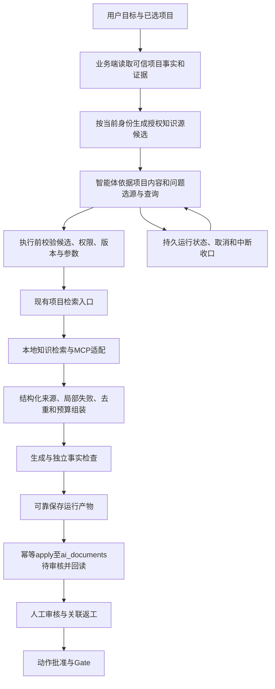

# IPD 系统设计深度评审：项目上下文、知识库与 MCP

日期：2026-10-01（用户时区）。裁决：**部分闭环，当前不能认定为最佳设计或生产就绪。** 研究结论已交付，改造建议为 DRAFT_ONLY。**协议基准已按用户纠正更新为当前 MCP 2026-07-28；旧协议探针只作兼容证据。**

本评审复用总计划能力 D（概念与计划）及 R242，不创建第二套执行状态。本次主要覆盖项目智能体纵向链，延伸核对产品/项目、阶段与 Gate 的治理关系；不是全仓全部模块、49页全部要求或全部浏览器旅程的审计。

## 1. 结论

应保留现有“确定性的 IPD 业务工作流 + 受控智能体执行专业工作”的主干。六阶段、动作目录、真实 Person、原有产物审核、动作批准和 Gate 是业务权威。智能体负责分析项目、组织检索、生成和自检，权限与最终业务状态仍由业务服务裁决。这与 [Anthropic 的 workflow/agent 分工原则](https://www.anthropic.com/engineering/building-effective-agents)相符；这是适用性判断，不是唯一行业标准。

用户提出“基于项目信息分析并调用 MCP”合理。此前“项目未指定产线就先不绑定 MCP”的处理不够完整：**正式归属、知识相关性、访问权限是三个不同维度**。未知归属可以继续依据可信项目内容选择获授权知识源；它既不表示没有可检索资料，也不授予全部库访问权限。

当前主要缺口不是缺17个地址，而是缺“项目事实 → 授权候选 → 智能选源 → 可复核证据 → 可恢复运行 → 业务应用回读”的完整链。仅把地址加入配置、把更多工具交给模型，不能解决这些缺口。

## 2. 本次事实与验证

- 当前数据库回读：运行 `2105858033761505281` 为 SUCCEEDED，项目9140005、人员900103、动作C02；SOURCE包含海康威视.md、docId和原句“研发费用率12.83%”；对应 TOOL_RESULT 为 SUCCESS。
- 项目9140005当前名称“熵基互联+智能锁联动”，归属未指定产品线，当前CONCEPT。**这个名称本身已经能形成“熵基互联”候选线索**，无需让用户重复抄项目资料；但名称不证明访问权限，也不证明某库一定包含智能锁内容。
- 附件出处创建人为字符串 `wb-kb-20260806`。此轮只读复核，没有重改这项修复。
- 当前16039监听Java PID18686，磁盘JAR inode283680217，包中存在相关类。存在性不等于全量源码与加载字节码一致；未重启、未重新生成模型产物。
- 现有MCP配置表REMOTE行数为0。门禁、考勤、智能视频3/17端点握手和tools/list成功；没有tools/call，不能认定检索结果或项目运行接入通过。
- 当前源码的完成检查类做了独立可执行反例：SOURCE命中12.83%，正文12.83%、13.09%、117.53%均返回null（不拒绝）；零命中且未声明未取得时会拒绝。**证明该检查不校验数字忠实度，不代表真实运行生成了错误数值。** javac与java均退出0，代码和原始输出留在证据文件。
- MCP配置字段及凭据渲染门禁实跑PASS，读取键为args/baseUrl/command；这只验证已有配置契约，不验证MCP运行接入。

原始证据：[当前事实证据.json](./当前事实证据.json)、[完成门数字反例.json](./完成门数字反例.json)、[MCP协议探针](/Users/mac/.codex/visualizations/2026/10/02/01a0faab-5186-73c0-8995-be189cfd9cf5/mcp-probe.json)。来源原文的数字是否符合真实年报，未在本次财务核实范围内；本评审只验证检索和生成的证据关系。

## 3. 设计对照

| 方面 | 现状及源码证据 | 裁决 |
|---|---|---|
| 业务治理主干 | IpdCopilotAccess逐次身份与项目授权；StageAcceptanceService禁自批；GateEngine完成+确认人；AiDocumentService原审核链 | 保留。运行成功与产物审核、动作批准、Gate放行分开是合理的 |
| 项目上下文 | 初次调查普通运行无项目语义事实；最新磁盘源码已加入loadProjectFacts→Spec.projectFacts→Prompt（尚未证明运行包生效） | 部分源码已补，待验。现有四行事实尚缺完整产线/型号/目标与版本追溯 |
| MCP智能选源 | 初次调查仅project_knowledge_search；最新磁盘源码出现ProductLineMcpTool.bind，实际运行接入仍待验 | 未闭环。应让模型在授权候选内选择，不要求用户固定指定产线 |
| 检索融合 | Retriever顺序调用三读面并拼接；向量共用4条额度先库占满；正文按附件名去重 | 部分闭环。存在向量与关键词，不等于已完成融合、去重和重排 |
| 来源和事实 | SOURCE以总hits/截断preview为主；CompletionGate只检查anyHit及部分固定词 | 部分闭环。不能保障每个数字、年份、单位与引用对应 |
| 失败语义 | Retriever保留向量失败块，但当前Inline工具hits=0时回NO_HIT_TEXT；正文/文档错误可整次失败 | 有明确缺口。未命中、故障、无权不能混同 |
| 恢复与可复现 | Spec仅内存；Kernel调用disableSessionPersistence（后经2.0.3源码复核为no-op，见第9节）；Executor本机map与定时器；快照只存部分配置 | 未闭环。历史回读不等于重启可接管；需先明确失败收口还是恢复执行 |
| 定档与回读 | createGenerated先于markApplied，外层无事务；已应用回放硬编码GENERATED/NOT_INDEXED | 并发/崩溃孤儿风险待实证；陈旧回执应读真实状态 |
| 能力覆盖和体验 | 内置包仅C02；用户工作方式目标涵盖更多动作 | 局部切片。不能按一条成功运行认定六阶段AI工作全覆盖 |
| Gate业务决策 | GateEngine查完整性；GateReviewService签署为APPROVE/REJECT | 保留现有合同。与投资决策完整语义的差异需业务裁决，不擅自添加新状态 |

精确源码位置和局部判断见三份专业评审：[MCP](./MCP官方最佳实践研究.md)、[检索和上下文](./检索与上下文最佳实践研究.md)、[业务治理和恢复](./业务治理与运行恢复独立评审.md)。定档风险属于静态推导，尚无真库并发/崩溃试验，不写成已发生故障。

## 4. 适合本项目的目标设计

该图是建议的责任分配，不是当前全部已实现的调用链。状态、权限、产物仍归IPD；AgentScope复用已选执行内核和官方MCP连接能力。不要另起聊天内核、文档表或模型网关。

### 4.1 可信项目事实

由服务端在现有项目授权后读取项目名称、类型、产品、正式产品线、目标市场、当前阶段/动作、已审核材料、未解决问题。业务字段与用户输入、外部检索资料分开标注。每次运行冻结事实版本或摘要；信息变化时重新读取，不能用前端文本替代权威记录。

项目名称里的“熵基互联”可支持相关性候选；正式归属仍由原业务流程决定。跨产线方案可以选择多个获授权源，逐项说明其用途。缺少会影响结论的事实时才澄清，不让用户承担系统已有数据的搬运。

### 4.2 MCP与工具接口

先使用一个清晰的知识检索业务接口，隐藏17个端点、连接、认证、协议和健康检查。配置权威优先复用现有MCP目录；运行使用项目能力编号，不能把MCP市场编号直接作为toolIds。

模型选择“需要哪些知识”，系统决定“能调用什么”。候选目录只包含获授权来源的名称、业务范围和能力说明；URLs和访问凭据不进入模型提示词。目录错描述、远端工具变化须可检测，不能依据远端名称自动授权。17条配置规模目前不必引入一个新的工具搜索平台；仅在评测证明需要时采用官方按需工具组。

[MCP官方工具规范](https://modelcontextprotocol.io/specification/2026-07-28/server/tools)允许模型控制工具选择；[官方风险说明](https://blog.modelcontextprotocol.io/posts/2026-03-16-tool-annotations/)指出annotations只是提示。当前3条无readOnlyHint，不能补一个true就宣称已证明只读。

### 4.3 知识证据

统一本地片段与远端结果的结构，但不混淆等级：原文片段、远端应用生成答案、推算、未取得、失败分别记录。FastGPT MCP执行的是应用，实际是否返回原始引用需tools/call验证；只有远端答案时，不把它命名为本地向量命中。[FastGPT官方MCP文档](https://doc.fastgpt.io/en/guide/build/publish/mcp_server)

先做稳定文档/片段/版本标识、去重和总上下文预算，再用同样问题与语料比较排名融合、可选重排的收益。依据固定事实样本测召回与生成忠实度，不能用工具SUCCESS代替质量。RRF和检索/生成分层评测可参考[Microsoft官方融合说明](https://learn.microsoft.com/en-us/azure/search/hybrid-search-ranking)与[官方RAG评测](https://learn.microsoft.com/en-us/azure/foundry/concepts/evaluation-evaluators/rag-evaluators)，不因此迁移到Azure。

### 4.4 运行与业务应用

先补中断后的明确终态和证据保留，再决定哪些长任务需要继续执行；恢复需要可重建输入、版本、检查点和逐次重验权限。框架提供状态存储不等于业务已实现恢复。应用文档和关联产物应在同一业务幂等/事务约束下完成；重复请求回读实际文档与索引状态。

[AgentScope Managed Agents官方分层](https://java.agentscope.io/v2/zh/blogs/managed-agents-agentscope-rumtime)可作责任划分参考，但本项目无需先引入完整托管平台、Vault、Sandbox集群或Temporal。

## 5. 与本地《最佳实践》的实际结合

先做两次定向语义检索。索引响应为served_from_current_index、possibly_stale且后台刷新中；未主动重建索引。关键结果直接读实际文件，重复AgentScope镜像只选一个。下面是实际阅读范围，不表示全库审阅。

| 本地资料 | 使用范围 | 吸收与取舍 |
|---|---|---|
| AgentScope-Java-docs-complete/v2/zh/blogs/usecases/finxscope.md | 190–225，尤其204–217 | 统一Knowledge接口与MCP连接生命周期；金融级配套平台不照搬 |
| 同镜像 docs/building-blocks/tool.md、docs/harness/architecture.md | 详见MCP研究稿第7节 | 小业务接口、工具组与权限分开；不把SDK默认放行当业务授权 |
| 同镜像 blogs/how-to-build-agent-harness系列及context/memory | 详见治理评审末节 | 外置状态和证据验证；按当前JAR核实，禁重复harness |
| 同镜像 blogs/managed-agents-agentscope-rumtime.md | 1–60、310–347 | 区分配置版本、事件、模型状态、工作区；官方在线交叉核验 |
| 深入理解AI Agent-设计原理与工程实践-v2.0.md | 3743–3820、4004–4200、8086–8121 | 智能体迭代检索、上下文与评测；二手观点须官方交叉验证 |
| 小明的AI实践社/生产级企业知识库RAG检索策略全梳理/article.md | 1–100 | 过滤、召回、融合、重排线索；不接受“重排最不能省”为无条件要求 |
| 忽南忽北Wq/深入探究Harness Engineering/article.md | 1–95 | 提示词不能补事实、上下文不等于RAG、执行需控制；六层模型不是强制工程标准 |
| 如此才是/GameDesignOS证据驱动与Human Gate文章 | 1–45、332–423 | 决策/证据/实验相连；回溯作者GitHub核验。游戏资产结构、CLI和7角色不移植 |
| 2026-09-28-AgentScope全量替换与IPD-AI体验执行提示词.md | 1–42 | 已明确“不是任务状态源”；仅作历史目标对照，不扩大本轮授权 |

本地资料没有在本轮建立完整IPD业务规范依据。六阶段和签署仍以本项目合同为准；[Stage-Gate官方资料](https://www.stage-gate.com/about/stage-gate-innovation-performance-framework/discovery-to-launch-process/)用于对照材料、质量和投资决策的区别，[PTC PLM官方资料](https://www.ptc.com/en/technologies/plm)用于对照长期产品对象与信息追溯，不照搬其整套产品。

## 6. 在同一总计划内的建议顺序与验收

1. 先完成可信项目上下文、授权候选、候选内智能选源。正例覆盖当前9140005未指定产线、单产线、多产线；负例覆盖无权源、误描述、伪造端点。**不能依赖用户手填知识库。**
2. 同时补检索结构化证据和局部失败，验证来源、原句、数字、年份、单位与推算；C02只生成待审稿，不自审、不自动完成动作。
3. 在定档与更长执行前补应用幂等和实际回读；双并发和创建后异常核文档行数。补中断收口、撤权和取消后迟到结果。
4. 用同版本模型、语料与运行包跑一条完整“生成→退回→返工→人工审核→受控应用→回读”纵向链，再推广能力覆盖。实测检索召回、引用正确性、无权命中、时延和调用量；具体阈值按业务风险确认，当前不虚构数字。

对比至少包括现状、仅补上下文与证据、加入融合、可选重排。无可测收益不增加多智能体、知识图谱或新框架。是否最佳只能在这些约束和实测结果内比较，不能给无基准分数。

## 7. 交付限制

本轮没有改业务代码、接入数据库配置、调用远端知识问答、重载后端、提交或推送。原向量切片维持闭环；MCP项目接入、C02业务完成、产物审核、PeerBridge证明与任务完成仍未闭环。PeerBridge现只有cursor-ipd身份能力，不能冒用它代表当前Codex完成证明，也不能绕过身份机制直接改SQLite。

本评审交付真实研究和诊断证据，不能被解释为实施完成。总计划保持PARTIAL。

## 8. 最新规范复核与对设计的实质修订

复核日期：2026-10-01（用户时区）。[官方版本页](https://modelcontextprotocol.io/docs/2026-07-28/learn/versioning)明确 Current 为 **2026-07-28**，不是草案。上一版评审使用2025-03-26作为MCP设计基准不当；本节及更新后的MCP专业稿为协议判断依据。原始2025探针不修改、不包装成2026验收。

### 8.1 需要改变的设计

| 最新基准 | 对本项目的影响与验收 |
|---|---|
| 请求级版本与能力，取消初始化握手和协议会话 | MCP适配须区分新协议、旧协议和双协议，记录实际使用版本；不能只替换一个版本字符串。项目运行/Person授权仍归业务端 |
| HTTP请求元数据和镜像请求头 | 检查 `_meta` 与 `MCP-Protocol-Version` 一致，提供 `Mcp-Method` 及适用的 `Mcp-Name`；需要JSON与请求级SSE两种响应解析。参数头映射须校验，不让项目秘密进入代理头 |
| 工具目录和缓存 | 稳定的工具顺序、分页处理与失效管理；目录缓存不能跨授权上下文复用，撤权不能等缓存过期才生效 |
| 多轮请求结果 | `input_required` 是待输入，不能记为工具完成或直接当知识答案；保留原样不透明 `requestState`，重试换请求ID，并限制轮数。用户可拒绝，不支持的能力不宣告 |
| 取消与断流 | 新HTTP下关闭请求SSE是取消信号；断流不再靠Last-Event-ID恢复。新请求重发前须区分可重试读取和结果未知，避免重复生成或其他副作用 |
| 可选扩展 | Tasks已移入扩展，不能因为升级核心协议便认为项目运行已持久恢复；不自动启用Sampling、Roots或远端技能来绕开既有治理 |

上述分工与适用判断属于项目设计建议。协议变更原文见[官方变更清单](https://modelcontextprotocol.io/specification/2026-07-28/changelog)。

### 8.2 新旧兼容不是一律回退

[版本与兼容规范](https://modelcontextprotocol.io/specification/2026-07-28/basic/versioning)定义了两代协议互操作：支持新版的服务若返回版本不支持，应从其支持列表选择共同版本；不能把这个错误误判为旧服务。HTTP需要检查失败响应体，不能遇到任何错误便无限重跑initialize。没有共同版本时应明确报兼容问题，既不装成功，也不自行升级全部依赖。

原门禁、考勤、视频探针证明的是旧式initialize链。它们可能仅支持旧版，也可能双协议；尚无新版请求证据，不能定性为不合规服务。适合本项目的是在同一知识适配边界兼容实际服务，业务模型继续只见授权知识源，不见协议分支。

[Streamable HTTP规范](https://modelcontextprotocol.io/specification/2026-07-28/basic/transports/streamable-http)要求请求头与正文匹配，取消通过关闭请求流实现；不再提供旧GET订阅流或SSE重放。原评审中“不能因HTTP断开便推断已取消”对最新HTTP应纠正为：**断开请求SSE应被服务视作取消，但不能据此证明已执行副作用被撤销**。取消竞态、超时和迟到结果仍需业务终态隔离。[取消规范](https://modelcontextprotocol.io/specification/2026-07-28/basic/patterns/cancellation)

### 8.3 最新工具语义如何支撑智能选源

[Tools规范](https://modelcontextprotocol.io/specification/2026-07-28/server/tools)仍允许模型依据上下文选工具。目录可因请求授权而变化，不能依赖隐式连接状态；多服务同名须消歧，serverInfo.name不能保证唯一。结构化结果可以是任意JSON；定义outputSchema时应校验，schema通过不证明事实真实。annotations不能替代业务授权。新响应的 `resultType` 必须正确处理；旧服务缺它时按complete兼容。

因此“未指定产品线”不阻断相关性分析，但候选生成与实际调用分别校验权限。17源用系统稳定服务ID映射，不能拿远端展示名称当唯一ID；项目证据摘要、源选择理由和协议版本留在同一run。模型输出不能自行改产品线归属。

[缓存规范](https://modelcontextprotocol.io/specification/2026-07-28/server/utilities/caching)规定ttlMs/cacheScope及授权上下文隔离；TTL只提示新鲜度，并非权限有效期。分页每页独立缓存，无全目录快照保证。项目建议：按服务配置版本、授权上下文、方法和参数隔离目录；收到变更通知失效，游标错误重新获取。撤权仍须执行前检查。

[MRTR规范](https://modelcontextprotocol.io/specification/2026-07-28/basic/patterns/mrtr)要求客户端原样传回requestState、重试使用新ID；服务端保护影响权限或业务的状态完整性。项目已有WAITING_APPROVAL可承载必要用户输入，但不把协议待输入自动变成人工审批通过。输入回执不跨run/用户重用，禁止无限追问。

### 8.4 当前依赖不能继承最新兼容声明

直接检查磁盘候选包：AgentScope2.0.3、mcp-core/mcp0.17.2、langchain4j-mcp1.17.2-beta27。本地mcp-core0.17.2源包McpSchema声明LATEST_PROTOCOL_VERSION=2025-06-18并定义initialize。内嵌类也检出对应字面值。这足以说明**不能仅凭使用MCP SDK就宣称2026兼容**；未发现字符串不能作为绝对不支持判定，仍需实际客户端构造与协议试验。

证据：[MCP最新版依赖核对.json](./MCP最新版依赖核对.json)。本轮没有升级依赖、编译新版适配或请求集团新版端点，也没有重新证明运行PID与全部候选字节码一致。

### 8.5 增补到原总计划的验收要求

沿用原建议顺序，在MCP接入节点加入以下可复核条件：

1. 同一项目运行适配新版、旧版、双协议服务；共同版本选择正确，无共同版本明确失败，授权错误不触发盲目协议回退。
2. 请求头/正文不一致、错误参数头、JSON/SSE响应、目录分页/变更与跨身份缓存分别有结果证据。
3. input_required、拒绝、轮数超限、断流、取消竞态和迟到结果不会变成成功知识命中。
4. 工具结果schema、引用和数字忠实度分别验证；协议成功不会自动完成C02、审核或Gate。
5. 需要长期任务时独立验收Tasks扩展和业务恢复；普通检索不为追赶新功能强行引入该扩展。

**更新后的裁决仍为部分闭环，且新增“最新版协议适配能力待验”缺口。** 用户要求的深度研究已修订，不能把研究更新解释为MCP项目接入已完成。

## 9. 参考 AgentScope Java 源码的复核与最小实施

用户要求参考 `/Users/mac/Documents/agentscope-java`。实际只读基线 HEAD `e9721285c63a37c10b1d07aa540408e57ba56ab2`，工作树干净，POM为2.0.4-SNAPSHOT；IPD仍为2.0.3。本地参考仓库没有语义索引，未建索引，以已知符号精确查找并阅读相关源码。专业评审追加源码及2.0.3发布API核对；未修改参考仓库。

### 必须纠正的两项事实

1. `disableSessionPersistence()`在2.0.3源码HarnessAgent:2215–2218已经是no-op，默认构建路径:2360–2374会绑定JsonFileAgentStateStore。上一轮“调用此方法即禁用持久化”判断错误。框架默认文件存储仍不提供IPD运行租约、重启接管或业务恢复。
2. 当前磁盘源码已有ProjectAgentRunService.loadProjectFacts→Spec.projectFacts→Prompt的四行授权事实，以及ProductLineMcpTool绑定。这是后续在途源码，不能继续写成完全不存在，也不能认定16039已生效。保留原样，仅复核；不覆盖其他会话的MCP实现。

### 源码采用与取舍

- HarnessAgent使用明确RuntimeContext，维持KernelScopeKey四维隔离；不照用SNAPSHOT新增runId API，2.0.3未核到相同接口。
- 工具故障使用官方ToolResultBlock.error，保留模型的错误观察。SDK文本结果在Toolkit处理前处于RUNNING是其契约，不要求原始text工厂返回SUCCESS。
- 2.0.3可使用McpClientBuilder的Streamable HTTP、初始化/调用超时、Toolkit MCP工具白名单。SNAPSHOT的propagateMeta(false)、closeMcpClients未在2.0.3公开API核到，不直接迁入。
- 参考仓库BOM也仍使用mcp0.17.2，因此不能靠切到此SNAPSHOT认定兼容2026-07-28。
- 不新增Harness、业务运行表、文档表或AgentScope计划模式。已有技能由业务端确定性注入符合目前可追溯目标，不为功能齐全开放子代理、文件或长期记忆。

### 本轮局部修复

零命中且含知识库向量失败时，原工具和真实注册的Inline工具都丢掉故障文本，改成“没有资料”。现在两者共用结果映射：FAILED返回SDK错误；PARTIAL保留失败与可用证据；NO_HIT才使用未取得文案。SOURCE增加retrievalStatus，不改表结构、项目权限或检索边界。此修复不把部分知识命中当动作完成。

测试、门禁、运行限制及状态以同目录 `AgentScope源码对照实施证据.md` 为准。全部最佳实践闭环仍需要当前包HTTP/DB验收、MCP协议兼容、数值引用验证、产物原子应用与恢复故障试验，不以本轮局部修复宣称达成。

## 全项目综合计划与快照说明

前文现状是各调查时点的快照，不能把初次PID或源码状态视为持续不变。后续局部改动及测试见[源码实施证据](./AgentScope源码对照实施证据.md)。结合用户新增九份材料与Doubao HTML后的统一设计、纠偏、既有W/U/G映射和验收计划见[全项目AI优化设计与后续计划](./全项目AI优化设计与后续计划.md)，后者为本轮综合阅读入口，执行状态仍归原总计划。
